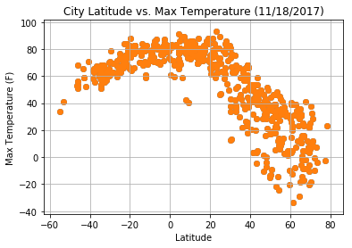
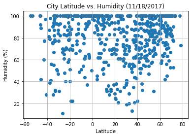
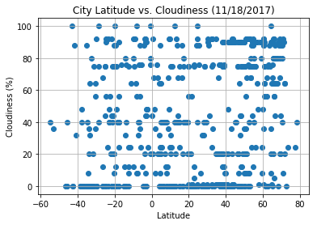
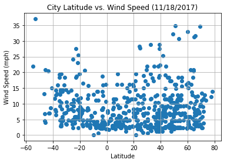

# WeatherPy

### Analysis
-  Trend 1: The temperature is, of course, higher toward the equator and lower as you go further away from the equator. 
-  Trend 2: There’s no clear trend between latitude and humidity/cloudiness. 
-  Trend 3: It is rare for locations to have high wind speeds, as most places are below 10 mph. 


```python
import json
import requests
import csv
import openweathermapy as ow
import matplotlib.pyplot as plt
import pandas as pd
import numpy as np
from citipy import citipy
from config import api_key
```

## Generate Cities List


```python
# Build a list of cities
cities = []

# Make a list of random lats, lngs values
for x in range(10): 
    lats = np.random.uniform(low=-90.000, high=90.000, size=1500)
    lngs = np.random.uniform(low=-180.000, high=180.000, size=1500)

lats_lngs = zip(lats, lngs)

# Make a for loop to get cities by lats, lngs
for lat, lon in lats_lngs:
    city = citipy.nearest_city(lat, lon)
    city = city.city_name
    
    if city not in cities:
        cities.append(city)

print(len(cities))
```

    619


## Perform API Calls


```python
# Print the list to make sure it works
print("Beginning Data Retrieval")
print("-" * 30)

row_count = 1

# Create a list to hold the info parsed 
city_data = []

# Loop through to get the info per city 
for city in cities:
    
    # Create the endpoint URL
    base_url = "http://api.openweathermap.org/data/2.5/weather"
    
    params = {
        "units": "IMPERIAL",  
        "APPID": api_key, 
        "q": city
    }
    
    # Run requests to get the JSON files
    city_response = requests.get(base_url, params=params)
    
    # Print the list of URLS to make sure the loop works
    print(f"Processing Record {row_count} | {city}")
    print(city_response.url)
    row_count += 1
    
    # Use try/except to skip any cities with errors 
    try: 
        city_response_json = city_response.json()
        city_cloudiness = city_response_json["clouds"]["all"]
        country = city_response_json["sys"]["country"]
        city_date = city_response_json["dt"]
        city_humidity = city_response_json["main"]["humidity"]
        city_lat = city_response_json["coord"]["lat"]
        city_lng = city_response_json["coord"]["lon"]
        city_max_temp = city_response_json["main"]["temp_max"]
        city_wind_speed = city_response_json["wind"]["speed"]
        
        # Append the list to a single dictionary for each parameter 
        city_data.append({"City": city, 
                          "Cloudiness": city_cloudiness, 
                          "Country": country, 
                          "Date": city_date, 
                          "Humidity": city_humidity, 
                          "Lat": city_lat, 
                          "Lng": city_lng, 
                          "Max Temp": city_max_temp, 
                          "Wind Speed": city_wind_speed})
        
    except KeyError:
        print("City not found. Skipping...")

print("-" * 30)
print("Data Retrieval Complete")
print("-" * 30)
```

    Beginning Data Retrieval
    ------------------------------
    Processing Record 1 | moose factory
    http://api.openweathermap.org/data/2.5/weather?units=IMPERIAL&APPID=87a4d9f60074ea85425e7f1ddedd5ea1&q=moose+factory
    City not found. Skipping...
    Processing Record 2 | vaitupu
    http://api.openweathermap.org/data/2.5/weather?units=IMPERIAL&APPID=87a4d9f60074ea85425e7f1ddedd5ea1&q=vaitupu
    City not found. Skipping...
    Processing Record 3 | meulaboh
    http://api.openweathermap.org/data/2.5/weather?units=IMPERIAL&APPID=87a4d9f60074ea85425e7f1ddedd5ea1&q=meulaboh
    Processing Record 4 | albany
    http://api.openweathermap.org/data/2.5/weather?units=IMPERIAL&APPID=87a4d9f60074ea85425e7f1ddedd5ea1&q=albany
    Processing Record 5 | manavalakurichi
    http://api.openweathermap.org/data/2.5/weather?units=IMPERIAL&APPID=87a4d9f60074ea85425e7f1ddedd5ea1&q=manavalakurichi
    Processing Record 6 | mataura
    http://api.openweathermap.org/data/2.5/weather?units=IMPERIAL&APPID=87a4d9f60074ea85425e7f1ddedd5ea1&q=mataura
    Processing Record 7 | illoqqortoormiut
    http://api.openweathermap.org/data/2.5/weather?units=IMPERIAL&APPID=87a4d9f60074ea85425e7f1ddedd5ea1&q=illoqqortoormiut
    Processing Record 8 | bredasdorp
    http://api.openweathermap.org/data/2.5/weather?units=IMPERIAL&APPID=87a4d9f60074ea85425e7f1ddedd5ea1&q=bredasdorp
    Processing Record 9 | hermanus
    http://api.openweathermap.org/data/2.5/weather?units=IMPERIAL&APPID=87a4d9f60074ea85425e7f1ddedd5ea1&q=hermanus
    Processing Record 10 | torbay
    http://api.openweathermap.org/data/2.5/weather?units=IMPERIAL&APPID=87a4d9f60074ea85425e7f1ddedd5ea1&q=torbay
    Processing Record 11 | progreso
    http://api.openweathermap.org/data/2.5/weather?units=IMPERIAL&APPID=87a4d9f60074ea85425e7f1ddedd5ea1&q=progreso
    Processing Record 12 | punta arenas
    http://api.openweathermap.org/data/2.5/weather?units=IMPERIAL&APPID=87a4d9f60074ea85425e7f1ddedd5ea1&q=punta+arenas
    Processing Record 13 | cape town
    http://api.openweathermap.org/data/2.5/weather?units=IMPERIAL&APPID=87a4d9f60074ea85425e7f1ddedd5ea1&q=cape+town
    Processing Record 14 | ponta do sol
    http://api.openweathermap.org/data/2.5/weather?units=IMPERIAL&APPID=87a4d9f60074ea85425e7f1ddedd5ea1&q=ponta+do+sol
    Processing Record 15 | busselton
    http://api.openweathermap.org/data/2.5/weather?units=IMPERIAL&APPID=87a4d9f60074ea85425e7f1ddedd5ea1&q=busselton
    Processing Record 16 | mecca
    http://api.openweathermap.org/data/2.5/weather?units=IMPERIAL&APPID=87a4d9f60074ea85425e7f1ddedd5ea1&q=mecca
    Processing Record 17 | yulara
    http://api.openweathermap.org/data/2.5/weather?units=IMPERIAL&APPID=87a4d9f60074ea85425e7f1ddedd5ea1&q=yulara
    Processing Record 18 | ciudad real
    http://api.openweathermap.org/data/2.5/weather?units=IMPERIAL&APPID=87a4d9f60074ea85425e7f1ddedd5ea1&q=ciudad+real
    Processing Record 19 | ancud
    http://api.openweathermap.org/data/2.5/weather?units=IMPERIAL&APPID=87a4d9f60074ea85425e7f1ddedd5ea1&q=ancud
    Processing Record 20 | dikson
    http://api.openweathermap.org/data/2.5/weather?units=IMPERIAL&APPID=87a4d9f60074ea85425e7f1ddedd5ea1&q=dikson
    Processing Record 21 | vardo
    http://api.openweathermap.org/data/2.5/weather?units=IMPERIAL&APPID=87a4d9f60074ea85425e7f1ddedd5ea1&q=vardo
    Processing Record 22 | ushuaia
    http://api.openweathermap.org/data/2.5/weather?units=IMPERIAL&APPID=87a4d9f60074ea85425e7f1ddedd5ea1&q=ushuaia
    Processing Record 23 | bluff
    http://api.openweathermap.org/data/2.5/weather?units=IMPERIAL&APPID=87a4d9f60074ea85425e7f1ddedd5ea1&q=bluff
    Processing Record 24 | vila franca do campo
    http://api.openweathermap.org/data/2.5/weather?units=IMPERIAL&APPID=87a4d9f60074ea85425e7f1ddedd5ea1&q=vila+franca+do+campo
    Processing Record 25 | cagayan de tawi-tawi
    http://api.openweathermap.org/data/2.5/weather?units=IMPERIAL&APPID=87a4d9f60074ea85425e7f1ddedd5ea1&q=cagayan+de+tawi-tawi
    City not found. Skipping...
    Processing Record 26 | kahului
    http://api.openweathermap.org/data/2.5/weather?units=IMPERIAL&APPID=87a4d9f60074ea85425e7f1ddedd5ea1&q=kahului
    Processing Record 27 | porto novo
    http://api.openweathermap.org/data/2.5/weather?units=IMPERIAL&APPID=87a4d9f60074ea85425e7f1ddedd5ea1&q=porto+novo
    Processing Record 28 | houma
    http://api.openweathermap.org/data/2.5/weather?units=IMPERIAL&APPID=87a4d9f60074ea85425e7f1ddedd5ea1&q=houma
    Processing Record 29 | lobito
    http://api.openweathermap.org/data/2.5/weather?units=IMPERIAL&APPID=87a4d9f60074ea85425e7f1ddedd5ea1&q=lobito
    Processing Record 30 | katsuura
    http://api.openweathermap.org/data/2.5/weather?units=IMPERIAL&APPID=87a4d9f60074ea85425e7f1ddedd5ea1&q=katsuura
    Processing Record 31 | saint anthony
    http://api.openweathermap.org/data/2.5/weather?units=IMPERIAL&APPID=87a4d9f60074ea85425e7f1ddedd5ea1&q=saint+anthony
    Processing Record 32 | new norfolk
    http://api.openweathermap.org/data/2.5/weather?units=IMPERIAL&APPID=87a4d9f60074ea85425e7f1ddedd5ea1&q=new+norfolk
    Processing Record 33 | jamestown
    http://api.openweathermap.org/data/2.5/weather?units=IMPERIAL&APPID=87a4d9f60074ea85425e7f1ddedd5ea1&q=jamestown
    Processing Record 34 | east london
    http://api.openweathermap.org/data/2.5/weather?units=IMPERIAL&APPID=87a4d9f60074ea85425e7f1ddedd5ea1&q=east+london
    Processing Record 35 | utiroa
    http://api.openweathermap.org/data/2.5/weather?units=IMPERIAL&APPID=87a4d9f60074ea85425e7f1ddedd5ea1&q=utiroa
    City not found. Skipping...
    Processing Record 36 | tungor
    http://api.openweathermap.org/data/2.5/weather?units=IMPERIAL&APPID=87a4d9f60074ea85425e7f1ddedd5ea1&q=tungor
    Processing Record 37 | bengkulu
    http://api.openweathermap.org/data/2.5/weather?units=IMPERIAL&APPID=87a4d9f60074ea85425e7f1ddedd5ea1&q=bengkulu
    Processing Record 38 | gao
    http://api.openweathermap.org/data/2.5/weather?units=IMPERIAL&APPID=87a4d9f60074ea85425e7f1ddedd5ea1&q=gao
    Processing Record 39 | tamasopo
    http://api.openweathermap.org/data/2.5/weather?units=IMPERIAL&APPID=87a4d9f60074ea85425e7f1ddedd5ea1&q=tamasopo
    Processing Record 40 | kavieng
    http://api.openweathermap.org/data/2.5/weather?units=IMPERIAL&APPID=87a4d9f60074ea85425e7f1ddedd5ea1&q=kavieng
    Processing Record 41 | ibitinga
    http://api.openweathermap.org/data/2.5/weather?units=IMPERIAL&APPID=87a4d9f60074ea85425e7f1ddedd5ea1&q=ibitinga
    Processing Record 42 | vaini
    http://api.openweathermap.org/data/2.5/weather?units=IMPERIAL&APPID=87a4d9f60074ea85425e7f1ddedd5ea1&q=vaini
    Processing Record 43 | saint-philippe
    http://api.openweathermap.org/data/2.5/weather?units=IMPERIAL&APPID=87a4d9f60074ea85425e7f1ddedd5ea1&q=saint-philippe
    Processing Record 44 | perth
    http://api.openweathermap.org/data/2.5/weather?units=IMPERIAL&APPID=87a4d9f60074ea85425e7f1ddedd5ea1&q=perth
    Processing Record 45 | deputatskiy
    http://api.openweathermap.org/data/2.5/weather?units=IMPERIAL&APPID=87a4d9f60074ea85425e7f1ddedd5ea1&q=deputatskiy
    Processing Record 46 | caravelas
    http://api.openweathermap.org/data/2.5/weather?units=IMPERIAL&APPID=87a4d9f60074ea85425e7f1ddedd5ea1&q=caravelas
    Processing Record 47 | rikitea
    http://api.openweathermap.org/data/2.5/weather?units=IMPERIAL&APPID=87a4d9f60074ea85425e7f1ddedd5ea1&q=rikitea
    Processing Record 48 | karratha
    http://api.openweathermap.org/data/2.5/weather?units=IMPERIAL&APPID=87a4d9f60074ea85425e7f1ddedd5ea1&q=karratha
    Processing Record 49 | encruzilhada do sul
    http://api.openweathermap.org/data/2.5/weather?units=IMPERIAL&APPID=87a4d9f60074ea85425e7f1ddedd5ea1&q=encruzilhada+do+sul
    Processing Record 50 | novikovo
    http://api.openweathermap.org/data/2.5/weather?units=IMPERIAL&APPID=87a4d9f60074ea85425e7f1ddedd5ea1&q=novikovo
    City not found. Skipping...
    Processing Record 51 | yellowknife
    http://api.openweathermap.org/data/2.5/weather?units=IMPERIAL&APPID=87a4d9f60074ea85425e7f1ddedd5ea1&q=yellowknife
    Processing Record 52 | hilo
    http://api.openweathermap.org/data/2.5/weather?units=IMPERIAL&APPID=87a4d9f60074ea85425e7f1ddedd5ea1&q=hilo
    Processing Record 53 | athens
    http://api.openweathermap.org/data/2.5/weather?units=IMPERIAL&APPID=87a4d9f60074ea85425e7f1ddedd5ea1&q=athens
    Processing Record 54 | tasiilaq
    http://api.openweathermap.org/data/2.5/weather?units=IMPERIAL&APPID=87a4d9f60074ea85425e7f1ddedd5ea1&q=tasiilaq
    Processing Record 55 | huarmey
    http://api.openweathermap.org/data/2.5/weather?units=IMPERIAL&APPID=87a4d9f60074ea85425e7f1ddedd5ea1&q=huarmey
    Processing Record 56 | chokurdakh
    http://api.openweathermap.org/data/2.5/weather?units=IMPERIAL&APPID=87a4d9f60074ea85425e7f1ddedd5ea1&q=chokurdakh
    Processing Record 57 | olafsvik
    http://api.openweathermap.org/data/2.5/weather?units=IMPERIAL&APPID=87a4d9f60074ea85425e7f1ddedd5ea1&q=olafsvik
    Processing Record 58 | cheuskiny
    http://api.openweathermap.org/data/2.5/weather?units=IMPERIAL&APPID=87a4d9f60074ea85425e7f1ddedd5ea1&q=cheuskiny
    City not found. Skipping...
    Processing Record 59 | yumen
    http://api.openweathermap.org/data/2.5/weather?units=IMPERIAL&APPID=87a4d9f60074ea85425e7f1ddedd5ea1&q=yumen
    Processing Record 60 | tuktoyaktuk
    http://api.openweathermap.org/data/2.5/weather?units=IMPERIAL&APPID=87a4d9f60074ea85425e7f1ddedd5ea1&q=tuktoyaktuk
    Processing Record 61 | barrow
    http://api.openweathermap.org/data/2.5/weather?units=IMPERIAL&APPID=87a4d9f60074ea85425e7f1ddedd5ea1&q=barrow
    Processing Record 62 | vung tau
    http://api.openweathermap.org/data/2.5/weather?units=IMPERIAL&APPID=87a4d9f60074ea85425e7f1ddedd5ea1&q=vung+tau
    Processing Record 63 | puerto maldonado
    http://api.openweathermap.org/data/2.5/weather?units=IMPERIAL&APPID=87a4d9f60074ea85425e7f1ddedd5ea1&q=puerto+maldonado
    Processing Record 64 | sambava
    http://api.openweathermap.org/data/2.5/weather?units=IMPERIAL&APPID=87a4d9f60074ea85425e7f1ddedd5ea1&q=sambava
    Processing Record 65 | ekhabi
    http://api.openweathermap.org/data/2.5/weather?units=IMPERIAL&APPID=87a4d9f60074ea85425e7f1ddedd5ea1&q=ekhabi
    City not found. Skipping...
    Processing Record 66 | kapaa
    http://api.openweathermap.org/data/2.5/weather?units=IMPERIAL&APPID=87a4d9f60074ea85425e7f1ddedd5ea1&q=kapaa
    Processing Record 67 | lodja
    http://api.openweathermap.org/data/2.5/weather?units=IMPERIAL&APPID=87a4d9f60074ea85425e7f1ddedd5ea1&q=lodja
    Processing Record 68 | morondava
    http://api.openweathermap.org/data/2.5/weather?units=IMPERIAL&APPID=87a4d9f60074ea85425e7f1ddedd5ea1&q=morondava
    Processing Record 69 | tuatapere
    http://api.openweathermap.org/data/2.5/weather?units=IMPERIAL&APPID=87a4d9f60074ea85425e7f1ddedd5ea1&q=tuatapere
    Processing Record 70 | airai
    http://api.openweathermap.org/data/2.5/weather?units=IMPERIAL&APPID=87a4d9f60074ea85425e7f1ddedd5ea1&q=airai
    Processing Record 71 | palmer
    http://api.openweathermap.org/data/2.5/weather?units=IMPERIAL&APPID=87a4d9f60074ea85425e7f1ddedd5ea1&q=palmer
    Processing Record 72 | bonavista
    http://api.openweathermap.org/data/2.5/weather?units=IMPERIAL&APPID=87a4d9f60074ea85425e7f1ddedd5ea1&q=bonavista
    Processing Record 73 | upernavik
    http://api.openweathermap.org/data/2.5/weather?units=IMPERIAL&APPID=87a4d9f60074ea85425e7f1ddedd5ea1&q=upernavik
    Processing Record 74 | souillac
    http://api.openweathermap.org/data/2.5/weather?units=IMPERIAL&APPID=87a4d9f60074ea85425e7f1ddedd5ea1&q=souillac
    Processing Record 75 | faanui
    http://api.openweathermap.org/data/2.5/weather?units=IMPERIAL&APPID=87a4d9f60074ea85425e7f1ddedd5ea1&q=faanui
    Processing Record 76 | arraial do cabo
    http://api.openweathermap.org/data/2.5/weather?units=IMPERIAL&APPID=87a4d9f60074ea85425e7f1ddedd5ea1&q=arraial+do+cabo
    Processing Record 77 | haibowan
    http://api.openweathermap.org/data/2.5/weather?units=IMPERIAL&APPID=87a4d9f60074ea85425e7f1ddedd5ea1&q=haibowan
    City not found. Skipping...
    Processing Record 78 | jacareacanga
    http://api.openweathermap.org/data/2.5/weather?units=IMPERIAL&APPID=87a4d9f60074ea85425e7f1ddedd5ea1&q=jacareacanga
    Processing Record 79 | hobart
    http://api.openweathermap.org/data/2.5/weather?units=IMPERIAL&APPID=87a4d9f60074ea85425e7f1ddedd5ea1&q=hobart
    Processing Record 80 | lavrentiya
    http://api.openweathermap.org/data/2.5/weather?units=IMPERIAL&APPID=87a4d9f60074ea85425e7f1ddedd5ea1&q=lavrentiya
    Processing Record 81 | palabuhanratu
    http://api.openweathermap.org/data/2.5/weather?units=IMPERIAL&APPID=87a4d9f60074ea85425e7f1ddedd5ea1&q=palabuhanratu
    City not found. Skipping...
    Processing Record 82 | camiri
    http://api.openweathermap.org/data/2.5/weather?units=IMPERIAL&APPID=87a4d9f60074ea85425e7f1ddedd5ea1&q=camiri
    Processing Record 83 | pangnirtung
    http://api.openweathermap.org/data/2.5/weather?units=IMPERIAL&APPID=87a4d9f60074ea85425e7f1ddedd5ea1&q=pangnirtung
    Processing Record 84 | sitka
    http://api.openweathermap.org/data/2.5/weather?units=IMPERIAL&APPID=87a4d9f60074ea85425e7f1ddedd5ea1&q=sitka
    Processing Record 85 | cherskiy
    http://api.openweathermap.org/data/2.5/weather?units=IMPERIAL&APPID=87a4d9f60074ea85425e7f1ddedd5ea1&q=cherskiy
    Processing Record 86 | kaitangata
    http://api.openweathermap.org/data/2.5/weather?units=IMPERIAL&APPID=87a4d9f60074ea85425e7f1ddedd5ea1&q=kaitangata
    Processing Record 87 | georgetown
    http://api.openweathermap.org/data/2.5/weather?units=IMPERIAL&APPID=87a4d9f60074ea85425e7f1ddedd5ea1&q=georgetown
    Processing Record 88 | port hedland
    http://api.openweathermap.org/data/2.5/weather?units=IMPERIAL&APPID=87a4d9f60074ea85425e7f1ddedd5ea1&q=port+hedland
    Processing Record 89 | longyearbyen
    http://api.openweathermap.org/data/2.5/weather?units=IMPERIAL&APPID=87a4d9f60074ea85425e7f1ddedd5ea1&q=longyearbyen
    Processing Record 90 | port alfred
    http://api.openweathermap.org/data/2.5/weather?units=IMPERIAL&APPID=87a4d9f60074ea85425e7f1ddedd5ea1&q=port+alfred
    Processing Record 91 | san jose
    http://api.openweathermap.org/data/2.5/weather?units=IMPERIAL&APPID=87a4d9f60074ea85425e7f1ddedd5ea1&q=san+jose
    Processing Record 92 | egvekinot
    http://api.openweathermap.org/data/2.5/weather?units=IMPERIAL&APPID=87a4d9f60074ea85425e7f1ddedd5ea1&q=egvekinot
    Processing Record 93 | nawa
    http://api.openweathermap.org/data/2.5/weather?units=IMPERIAL&APPID=87a4d9f60074ea85425e7f1ddedd5ea1&q=nawa
    Processing Record 94 | sola
    http://api.openweathermap.org/data/2.5/weather?units=IMPERIAL&APPID=87a4d9f60074ea85425e7f1ddedd5ea1&q=sola
    Processing Record 95 | norman wells
    http://api.openweathermap.org/data/2.5/weather?units=IMPERIAL&APPID=87a4d9f60074ea85425e7f1ddedd5ea1&q=norman+wells
    Processing Record 96 | shirokiy
    http://api.openweathermap.org/data/2.5/weather?units=IMPERIAL&APPID=87a4d9f60074ea85425e7f1ddedd5ea1&q=shirokiy
    Processing Record 97 | puerto ayora
    http://api.openweathermap.org/data/2.5/weather?units=IMPERIAL&APPID=87a4d9f60074ea85425e7f1ddedd5ea1&q=puerto+ayora
    Processing Record 98 | taolanaro
    http://api.openweathermap.org/data/2.5/weather?units=IMPERIAL&APPID=87a4d9f60074ea85425e7f1ddedd5ea1&q=taolanaro
    Processing Record 99 | baruun-urt
    http://api.openweathermap.org/data/2.5/weather?units=IMPERIAL&APPID=87a4d9f60074ea85425e7f1ddedd5ea1&q=baruun-urt
    Processing Record 100 | pisco
    http://api.openweathermap.org/data/2.5/weather?units=IMPERIAL&APPID=87a4d9f60074ea85425e7f1ddedd5ea1&q=pisco
    Processing Record 101 | mukhen
    http://api.openweathermap.org/data/2.5/weather?units=IMPERIAL&APPID=87a4d9f60074ea85425e7f1ddedd5ea1&q=mukhen
    Processing Record 102 | atuona
    http://api.openweathermap.org/data/2.5/weather?units=IMPERIAL&APPID=87a4d9f60074ea85425e7f1ddedd5ea1&q=atuona
    Processing Record 103 | bagdarin
    http://api.openweathermap.org/data/2.5/weather?units=IMPERIAL&APPID=87a4d9f60074ea85425e7f1ddedd5ea1&q=bagdarin
    Processing Record 104 | qaanaaq
    http://api.openweathermap.org/data/2.5/weather?units=IMPERIAL&APPID=87a4d9f60074ea85425e7f1ddedd5ea1&q=qaanaaq
    Processing Record 105 | bambous virieux
    http://api.openweathermap.org/data/2.5/weather?units=IMPERIAL&APPID=87a4d9f60074ea85425e7f1ddedd5ea1&q=bambous+virieux
    Processing Record 106 | nikolskoye
    http://api.openweathermap.org/data/2.5/weather?units=IMPERIAL&APPID=87a4d9f60074ea85425e7f1ddedd5ea1&q=nikolskoye
    City not found. Skipping...
    Processing Record 107 | udachnyy
    http://api.openweathermap.org/data/2.5/weather?units=IMPERIAL&APPID=87a4d9f60074ea85425e7f1ddedd5ea1&q=udachnyy
    Processing Record 108 | lashio
    http://api.openweathermap.org/data/2.5/weather?units=IMPERIAL&APPID=87a4d9f60074ea85425e7f1ddedd5ea1&q=lashio
    Processing Record 109 | palmerston
    http://api.openweathermap.org/data/2.5/weather?units=IMPERIAL&APPID=87a4d9f60074ea85425e7f1ddedd5ea1&q=palmerston
    Processing Record 110 | saldanha
    http://api.openweathermap.org/data/2.5/weather?units=IMPERIAL&APPID=87a4d9f60074ea85425e7f1ddedd5ea1&q=saldanha
    Processing Record 111 | avarua
    http://api.openweathermap.org/data/2.5/weather?units=IMPERIAL&APPID=87a4d9f60074ea85425e7f1ddedd5ea1&q=avarua
    Processing Record 112 | castro
    http://api.openweathermap.org/data/2.5/weather?units=IMPERIAL&APPID=87a4d9f60074ea85425e7f1ddedd5ea1&q=castro
    Processing Record 113 | namatanai
    http://api.openweathermap.org/data/2.5/weather?units=IMPERIAL&APPID=87a4d9f60074ea85425e7f1ddedd5ea1&q=namatanai
    Processing Record 114 | amudat
    http://api.openweathermap.org/data/2.5/weather?units=IMPERIAL&APPID=87a4d9f60074ea85425e7f1ddedd5ea1&q=amudat
    Processing Record 115 | santa cruz de la palma
    http://api.openweathermap.org/data/2.5/weather?units=IMPERIAL&APPID=87a4d9f60074ea85425e7f1ddedd5ea1&q=santa+cruz+de+la+palma
    Processing Record 116 | bambanglipuro
    http://api.openweathermap.org/data/2.5/weather?units=IMPERIAL&APPID=87a4d9f60074ea85425e7f1ddedd5ea1&q=bambanglipuro
    Processing Record 117 | cardston
    http://api.openweathermap.org/data/2.5/weather?units=IMPERIAL&APPID=87a4d9f60074ea85425e7f1ddedd5ea1&q=cardston
    Processing Record 118 | sao jose da coroa grande
    http://api.openweathermap.org/data/2.5/weather?units=IMPERIAL&APPID=87a4d9f60074ea85425e7f1ddedd5ea1&q=sao+jose+da+coroa+grande
    Processing Record 119 | cayenne
    http://api.openweathermap.org/data/2.5/weather?units=IMPERIAL&APPID=87a4d9f60074ea85425e7f1ddedd5ea1&q=cayenne
    Processing Record 120 | conde
    http://api.openweathermap.org/data/2.5/weather?units=IMPERIAL&APPID=87a4d9f60074ea85425e7f1ddedd5ea1&q=conde
    Processing Record 121 | luderitz
    http://api.openweathermap.org/data/2.5/weather?units=IMPERIAL&APPID=87a4d9f60074ea85425e7f1ddedd5ea1&q=luderitz
    Processing Record 122 | nizhneyansk
    http://api.openweathermap.org/data/2.5/weather?units=IMPERIAL&APPID=87a4d9f60074ea85425e7f1ddedd5ea1&q=nizhneyansk
    Processing Record 123 | rudbar
    http://api.openweathermap.org/data/2.5/weather?units=IMPERIAL&APPID=87a4d9f60074ea85425e7f1ddedd5ea1&q=rudbar
    Processing Record 124 | pacific grove
    http://api.openweathermap.org/data/2.5/weather?units=IMPERIAL&APPID=87a4d9f60074ea85425e7f1ddedd5ea1&q=pacific+grove
    Processing Record 125 | guaymas
    http://api.openweathermap.org/data/2.5/weather?units=IMPERIAL&APPID=87a4d9f60074ea85425e7f1ddedd5ea1&q=guaymas
    Processing Record 126 | xuddur
    http://api.openweathermap.org/data/2.5/weather?units=IMPERIAL&APPID=87a4d9f60074ea85425e7f1ddedd5ea1&q=xuddur
    Processing Record 127 | codrington
    http://api.openweathermap.org/data/2.5/weather?units=IMPERIAL&APPID=87a4d9f60074ea85425e7f1ddedd5ea1&q=codrington
    Processing Record 128 | nemuro
    http://api.openweathermap.org/data/2.5/weather?units=IMPERIAL&APPID=87a4d9f60074ea85425e7f1ddedd5ea1&q=nemuro
    Processing Record 129 | rundu
    http://api.openweathermap.org/data/2.5/weather?units=IMPERIAL&APPID=87a4d9f60074ea85425e7f1ddedd5ea1&q=rundu
    Processing Record 130 | mar del plata
    http://api.openweathermap.org/data/2.5/weather?units=IMPERIAL&APPID=87a4d9f60074ea85425e7f1ddedd5ea1&q=mar+del+plata
    Processing Record 131 | yanan
    http://api.openweathermap.org/data/2.5/weather?units=IMPERIAL&APPID=87a4d9f60074ea85425e7f1ddedd5ea1&q=yanan
    City not found. Skipping...
    Processing Record 132 | belushya guba
    http://api.openweathermap.org/data/2.5/weather?units=IMPERIAL&APPID=87a4d9f60074ea85425e7f1ddedd5ea1&q=belushya+guba
    City not found. Skipping...
    Processing Record 133 | fairbanks
    http://api.openweathermap.org/data/2.5/weather?units=IMPERIAL&APPID=87a4d9f60074ea85425e7f1ddedd5ea1&q=fairbanks
    Processing Record 134 | necochea
    http://api.openweathermap.org/data/2.5/weather?units=IMPERIAL&APPID=87a4d9f60074ea85425e7f1ddedd5ea1&q=necochea
    Processing Record 135 | port lavaca
    http://api.openweathermap.org/data/2.5/weather?units=IMPERIAL&APPID=87a4d9f60074ea85425e7f1ddedd5ea1&q=port+lavaca
    Processing Record 136 | key west
    http://api.openweathermap.org/data/2.5/weather?units=IMPERIAL&APPID=87a4d9f60074ea85425e7f1ddedd5ea1&q=key+west
    Processing Record 137 | mys shmidta
    http://api.openweathermap.org/data/2.5/weather?units=IMPERIAL&APPID=87a4d9f60074ea85425e7f1ddedd5ea1&q=mys+shmidta
    Processing Record 138 | santa maria
    http://api.openweathermap.org/data/2.5/weather?units=IMPERIAL&APPID=87a4d9f60074ea85425e7f1ddedd5ea1&q=santa+maria
    Processing Record 139 | saskylakh
    http://api.openweathermap.org/data/2.5/weather?units=IMPERIAL&APPID=87a4d9f60074ea85425e7f1ddedd5ea1&q=saskylakh
    Processing Record 140 | san patricio
    http://api.openweathermap.org/data/2.5/weather?units=IMPERIAL&APPID=87a4d9f60074ea85425e7f1ddedd5ea1&q=san+patricio
    Processing Record 141 | hithadhoo
    http://api.openweathermap.org/data/2.5/weather?units=IMPERIAL&APPID=87a4d9f60074ea85425e7f1ddedd5ea1&q=hithadhoo
    Processing Record 142 | barentsburg
    http://api.openweathermap.org/data/2.5/weather?units=IMPERIAL&APPID=87a4d9f60074ea85425e7f1ddedd5ea1&q=barentsburg
    Processing Record 143 | hosangadi
    http://api.openweathermap.org/data/2.5/weather?units=IMPERIAL&APPID=87a4d9f60074ea85425e7f1ddedd5ea1&q=hosangadi
    Processing Record 144 | yerbogachen
    http://api.openweathermap.org/data/2.5/weather?units=IMPERIAL&APPID=87a4d9f60074ea85425e7f1ddedd5ea1&q=yerbogachen
    Processing Record 145 | ayagoz
    http://api.openweathermap.org/data/2.5/weather?units=IMPERIAL&APPID=87a4d9f60074ea85425e7f1ddedd5ea1&q=ayagoz
    Processing Record 146 | peace river
    http://api.openweathermap.org/data/2.5/weather?units=IMPERIAL&APPID=87a4d9f60074ea85425e7f1ddedd5ea1&q=peace+river
    Processing Record 147 | bethel
    http://api.openweathermap.org/data/2.5/weather?units=IMPERIAL&APPID=87a4d9f60074ea85425e7f1ddedd5ea1&q=bethel
    Processing Record 148 | bubaque
    http://api.openweathermap.org/data/2.5/weather?units=IMPERIAL&APPID=87a4d9f60074ea85425e7f1ddedd5ea1&q=bubaque
    Processing Record 149 | saint-augustin
    http://api.openweathermap.org/data/2.5/weather?units=IMPERIAL&APPID=87a4d9f60074ea85425e7f1ddedd5ea1&q=saint-augustin
    Processing Record 150 | salalah
    http://api.openweathermap.org/data/2.5/weather?units=IMPERIAL&APPID=87a4d9f60074ea85425e7f1ddedd5ea1&q=salalah
    Processing Record 151 | chumphon
    http://api.openweathermap.org/data/2.5/weather?units=IMPERIAL&APPID=87a4d9f60074ea85425e7f1ddedd5ea1&q=chumphon
    Processing Record 152 | port elizabeth
    http://api.openweathermap.org/data/2.5/weather?units=IMPERIAL&APPID=87a4d9f60074ea85425e7f1ddedd5ea1&q=port+elizabeth
    Processing Record 153 | kishi
    http://api.openweathermap.org/data/2.5/weather?units=IMPERIAL&APPID=87a4d9f60074ea85425e7f1ddedd5ea1&q=kishi
    Processing Record 154 | mahebourg
    http://api.openweathermap.org/data/2.5/weather?units=IMPERIAL&APPID=87a4d9f60074ea85425e7f1ddedd5ea1&q=mahebourg
    Processing Record 155 | benguela
    http://api.openweathermap.org/data/2.5/weather?units=IMPERIAL&APPID=87a4d9f60074ea85425e7f1ddedd5ea1&q=benguela
    Processing Record 156 | fort nelson
    http://api.openweathermap.org/data/2.5/weather?units=IMPERIAL&APPID=87a4d9f60074ea85425e7f1ddedd5ea1&q=fort+nelson
    Processing Record 157 | sanlucar de barrameda
    http://api.openweathermap.org/data/2.5/weather?units=IMPERIAL&APPID=87a4d9f60074ea85425e7f1ddedd5ea1&q=sanlucar+de+barrameda
    Processing Record 158 | ca mau
    http://api.openweathermap.org/data/2.5/weather?units=IMPERIAL&APPID=87a4d9f60074ea85425e7f1ddedd5ea1&q=ca+mau
    Processing Record 159 | gat
    http://api.openweathermap.org/data/2.5/weather?units=IMPERIAL&APPID=87a4d9f60074ea85425e7f1ddedd5ea1&q=gat
    City not found. Skipping...
    Processing Record 160 | okhotsk
    http://api.openweathermap.org/data/2.5/weather?units=IMPERIAL&APPID=87a4d9f60074ea85425e7f1ddedd5ea1&q=okhotsk
    Processing Record 161 | lichuan
    http://api.openweathermap.org/data/2.5/weather?units=IMPERIAL&APPID=87a4d9f60074ea85425e7f1ddedd5ea1&q=lichuan
    Processing Record 162 | tiksi
    http://api.openweathermap.org/data/2.5/weather?units=IMPERIAL&APPID=87a4d9f60074ea85425e7f1ddedd5ea1&q=tiksi
    Processing Record 163 | cidreira
    http://api.openweathermap.org/data/2.5/weather?units=IMPERIAL&APPID=87a4d9f60074ea85425e7f1ddedd5ea1&q=cidreira
    Processing Record 164 | berlevag
    http://api.openweathermap.org/data/2.5/weather?units=IMPERIAL&APPID=87a4d9f60074ea85425e7f1ddedd5ea1&q=berlevag
    Processing Record 165 | lagoa
    http://api.openweathermap.org/data/2.5/weather?units=IMPERIAL&APPID=87a4d9f60074ea85425e7f1ddedd5ea1&q=lagoa
    Processing Record 166 | nanortalik
    http://api.openweathermap.org/data/2.5/weather?units=IMPERIAL&APPID=87a4d9f60074ea85425e7f1ddedd5ea1&q=nanortalik
    Processing Record 167 | lata
    http://api.openweathermap.org/data/2.5/weather?units=IMPERIAL&APPID=87a4d9f60074ea85425e7f1ddedd5ea1&q=lata
    Processing Record 168 | pevek
    http://api.openweathermap.org/data/2.5/weather?units=IMPERIAL&APPID=87a4d9f60074ea85425e7f1ddedd5ea1&q=pevek
    Processing Record 169 | santa rosalia
    http://api.openweathermap.org/data/2.5/weather?units=IMPERIAL&APPID=87a4d9f60074ea85425e7f1ddedd5ea1&q=santa+rosalia
    Processing Record 170 | sao filipe
    http://api.openweathermap.org/data/2.5/weather?units=IMPERIAL&APPID=87a4d9f60074ea85425e7f1ddedd5ea1&q=sao+filipe
    Processing Record 171 | tsihombe
    http://api.openweathermap.org/data/2.5/weather?units=IMPERIAL&APPID=87a4d9f60074ea85425e7f1ddedd5ea1&q=tsihombe
    Processing Record 172 | thinadhoo
    http://api.openweathermap.org/data/2.5/weather?units=IMPERIAL&APPID=87a4d9f60074ea85425e7f1ddedd5ea1&q=thinadhoo
    Processing Record 173 | provideniya
    http://api.openweathermap.org/data/2.5/weather?units=IMPERIAL&APPID=87a4d9f60074ea85425e7f1ddedd5ea1&q=provideniya
    Processing Record 174 | ilulissat
    http://api.openweathermap.org/data/2.5/weather?units=IMPERIAL&APPID=87a4d9f60074ea85425e7f1ddedd5ea1&q=ilulissat
    Processing Record 175 | takoradi
    http://api.openweathermap.org/data/2.5/weather?units=IMPERIAL&APPID=87a4d9f60074ea85425e7f1ddedd5ea1&q=takoradi
    Processing Record 176 | valleyview
    http://api.openweathermap.org/data/2.5/weather?units=IMPERIAL&APPID=87a4d9f60074ea85425e7f1ddedd5ea1&q=valleyview
    Processing Record 177 | temyasovo
    http://api.openweathermap.org/data/2.5/weather?units=IMPERIAL&APPID=87a4d9f60074ea85425e7f1ddedd5ea1&q=temyasovo
    Processing Record 178 | katherine
    http://api.openweathermap.org/data/2.5/weather?units=IMPERIAL&APPID=87a4d9f60074ea85425e7f1ddedd5ea1&q=katherine
    Processing Record 179 | hualmay
    http://api.openweathermap.org/data/2.5/weather?units=IMPERIAL&APPID=87a4d9f60074ea85425e7f1ddedd5ea1&q=hualmay
    Processing Record 180 | olavarria
    http://api.openweathermap.org/data/2.5/weather?units=IMPERIAL&APPID=87a4d9f60074ea85425e7f1ddedd5ea1&q=olavarria
    Processing Record 181 | paradwip
    http://api.openweathermap.org/data/2.5/weather?units=IMPERIAL&APPID=87a4d9f60074ea85425e7f1ddedd5ea1&q=paradwip
    City not found. Skipping...
    Processing Record 182 | ust-kut
    http://api.openweathermap.org/data/2.5/weather?units=IMPERIAL&APPID=87a4d9f60074ea85425e7f1ddedd5ea1&q=ust-kut
    Processing Record 183 | mount gambier
    http://api.openweathermap.org/data/2.5/weather?units=IMPERIAL&APPID=87a4d9f60074ea85425e7f1ddedd5ea1&q=mount+gambier
    Processing Record 184 | mpanda
    http://api.openweathermap.org/data/2.5/weather?units=IMPERIAL&APPID=87a4d9f60074ea85425e7f1ddedd5ea1&q=mpanda
    Processing Record 185 | fortuna
    http://api.openweathermap.org/data/2.5/weather?units=IMPERIAL&APPID=87a4d9f60074ea85425e7f1ddedd5ea1&q=fortuna
    Processing Record 186 | constitucion
    http://api.openweathermap.org/data/2.5/weather?units=IMPERIAL&APPID=87a4d9f60074ea85425e7f1ddedd5ea1&q=constitucion
    Processing Record 187 | jizan
    http://api.openweathermap.org/data/2.5/weather?units=IMPERIAL&APPID=87a4d9f60074ea85425e7f1ddedd5ea1&q=jizan
    Processing Record 188 | butaritari
    http://api.openweathermap.org/data/2.5/weather?units=IMPERIAL&APPID=87a4d9f60074ea85425e7f1ddedd5ea1&q=butaritari
    Processing Record 189 | kodiak
    http://api.openweathermap.org/data/2.5/weather?units=IMPERIAL&APPID=87a4d9f60074ea85425e7f1ddedd5ea1&q=kodiak
    Processing Record 190 | russell
    http://api.openweathermap.org/data/2.5/weather?units=IMPERIAL&APPID=87a4d9f60074ea85425e7f1ddedd5ea1&q=russell
    Processing Record 191 | huangzhai
    http://api.openweathermap.org/data/2.5/weather?units=IMPERIAL&APPID=87a4d9f60074ea85425e7f1ddedd5ea1&q=huangzhai
    Processing Record 192 | samusu
    http://api.openweathermap.org/data/2.5/weather?units=IMPERIAL&APPID=87a4d9f60074ea85425e7f1ddedd5ea1&q=samusu
    Processing Record 193 | ribeira grande
    http://api.openweathermap.org/data/2.5/weather?units=IMPERIAL&APPID=87a4d9f60074ea85425e7f1ddedd5ea1&q=ribeira+grande
    Processing Record 194 | katav-ivanovsk
    http://api.openweathermap.org/data/2.5/weather?units=IMPERIAL&APPID=87a4d9f60074ea85425e7f1ddedd5ea1&q=katav-ivanovsk
    Processing Record 195 | marataizes
    http://api.openweathermap.org/data/2.5/weather?units=IMPERIAL&APPID=87a4d9f60074ea85425e7f1ddedd5ea1&q=marataizes
    Processing Record 196 | horta
    http://api.openweathermap.org/data/2.5/weather?units=IMPERIAL&APPID=87a4d9f60074ea85425e7f1ddedd5ea1&q=horta
    Processing Record 197 | joshimath
    http://api.openweathermap.org/data/2.5/weather?units=IMPERIAL&APPID=87a4d9f60074ea85425e7f1ddedd5ea1&q=joshimath
    Processing Record 198 | isangel
    http://api.openweathermap.org/data/2.5/weather?units=IMPERIAL&APPID=87a4d9f60074ea85425e7f1ddedd5ea1&q=isangel
    Processing Record 199 | gazanjyk
    http://api.openweathermap.org/data/2.5/weather?units=IMPERIAL&APPID=87a4d9f60074ea85425e7f1ddedd5ea1&q=gazanjyk
    Processing Record 200 | chapleau
    http://api.openweathermap.org/data/2.5/weather?units=IMPERIAL&APPID=87a4d9f60074ea85425e7f1ddedd5ea1&q=chapleau
    Processing Record 201 | bage
    http://api.openweathermap.org/data/2.5/weather?units=IMPERIAL&APPID=87a4d9f60074ea85425e7f1ddedd5ea1&q=bage
    Processing Record 202 | nicoya
    http://api.openweathermap.org/data/2.5/weather?units=IMPERIAL&APPID=87a4d9f60074ea85425e7f1ddedd5ea1&q=nicoya
    Processing Record 203 | berkak
    http://api.openweathermap.org/data/2.5/weather?units=IMPERIAL&APPID=87a4d9f60074ea85425e7f1ddedd5ea1&q=berkak
    Processing Record 204 | kangaatsiaq
    http://api.openweathermap.org/data/2.5/weather?units=IMPERIAL&APPID=87a4d9f60074ea85425e7f1ddedd5ea1&q=kangaatsiaq
    Processing Record 205 | carnarvon
    http://api.openweathermap.org/data/2.5/weather?units=IMPERIAL&APPID=87a4d9f60074ea85425e7f1ddedd5ea1&q=carnarvon
    Processing Record 206 | havre-saint-pierre
    http://api.openweathermap.org/data/2.5/weather?units=IMPERIAL&APPID=87a4d9f60074ea85425e7f1ddedd5ea1&q=havre-saint-pierre
    Processing Record 207 | kerman
    http://api.openweathermap.org/data/2.5/weather?units=IMPERIAL&APPID=87a4d9f60074ea85425e7f1ddedd5ea1&q=kerman
    Processing Record 208 | anadyr
    http://api.openweathermap.org/data/2.5/weather?units=IMPERIAL&APPID=87a4d9f60074ea85425e7f1ddedd5ea1&q=anadyr
    Processing Record 209 | kabinda
    http://api.openweathermap.org/data/2.5/weather?units=IMPERIAL&APPID=87a4d9f60074ea85425e7f1ddedd5ea1&q=kabinda
    Processing Record 210 | cap malheureux
    http://api.openweathermap.org/data/2.5/weather?units=IMPERIAL&APPID=87a4d9f60074ea85425e7f1ddedd5ea1&q=cap+malheureux
    Processing Record 211 | tautira
    http://api.openweathermap.org/data/2.5/weather?units=IMPERIAL&APPID=87a4d9f60074ea85425e7f1ddedd5ea1&q=tautira
    Processing Record 212 | porto walter
    http://api.openweathermap.org/data/2.5/weather?units=IMPERIAL&APPID=87a4d9f60074ea85425e7f1ddedd5ea1&q=porto+walter
    Processing Record 213 | batagay-alyta
    http://api.openweathermap.org/data/2.5/weather?units=IMPERIAL&APPID=87a4d9f60074ea85425e7f1ddedd5ea1&q=batagay-alyta
    Processing Record 214 | qaqortoq
    http://api.openweathermap.org/data/2.5/weather?units=IMPERIAL&APPID=87a4d9f60074ea85425e7f1ddedd5ea1&q=qaqortoq
    Processing Record 215 | sayansk
    http://api.openweathermap.org/data/2.5/weather?units=IMPERIAL&APPID=87a4d9f60074ea85425e7f1ddedd5ea1&q=sayansk
    Processing Record 216 | guerrero negro
    http://api.openweathermap.org/data/2.5/weather?units=IMPERIAL&APPID=87a4d9f60074ea85425e7f1ddedd5ea1&q=guerrero+negro
    Processing Record 217 | saint-pierre
    http://api.openweathermap.org/data/2.5/weather?units=IMPERIAL&APPID=87a4d9f60074ea85425e7f1ddedd5ea1&q=saint-pierre
    Processing Record 218 | klaksvik
    http://api.openweathermap.org/data/2.5/weather?units=IMPERIAL&APPID=87a4d9f60074ea85425e7f1ddedd5ea1&q=klaksvik
    Processing Record 219 | tongliao
    http://api.openweathermap.org/data/2.5/weather?units=IMPERIAL&APPID=87a4d9f60074ea85425e7f1ddedd5ea1&q=tongliao
    Processing Record 220 | pacifica
    http://api.openweathermap.org/data/2.5/weather?units=IMPERIAL&APPID=87a4d9f60074ea85425e7f1ddedd5ea1&q=pacifica
    Processing Record 221 | angoram
    http://api.openweathermap.org/data/2.5/weather?units=IMPERIAL&APPID=87a4d9f60074ea85425e7f1ddedd5ea1&q=angoram
    Processing Record 222 | yamada
    http://api.openweathermap.org/data/2.5/weather?units=IMPERIAL&APPID=87a4d9f60074ea85425e7f1ddedd5ea1&q=yamada
    Processing Record 223 | keetmanshoop
    http://api.openweathermap.org/data/2.5/weather?units=IMPERIAL&APPID=87a4d9f60074ea85425e7f1ddedd5ea1&q=keetmanshoop
    Processing Record 224 | tacuarembo
    http://api.openweathermap.org/data/2.5/weather?units=IMPERIAL&APPID=87a4d9f60074ea85425e7f1ddedd5ea1&q=tacuarembo
    Processing Record 225 | neiafu
    http://api.openweathermap.org/data/2.5/weather?units=IMPERIAL&APPID=87a4d9f60074ea85425e7f1ddedd5ea1&q=neiafu
    Processing Record 226 | haines junction
    http://api.openweathermap.org/data/2.5/weather?units=IMPERIAL&APPID=87a4d9f60074ea85425e7f1ddedd5ea1&q=haines+junction
    Processing Record 227 | ardahan
    http://api.openweathermap.org/data/2.5/weather?units=IMPERIAL&APPID=87a4d9f60074ea85425e7f1ddedd5ea1&q=ardahan
    Processing Record 228 | warqla
    http://api.openweathermap.org/data/2.5/weather?units=IMPERIAL&APPID=87a4d9f60074ea85425e7f1ddedd5ea1&q=warqla
    City not found. Skipping...
    Processing Record 229 | kalia
    http://api.openweathermap.org/data/2.5/weather?units=IMPERIAL&APPID=87a4d9f60074ea85425e7f1ddedd5ea1&q=kalia
    Processing Record 230 | poum
    http://api.openweathermap.org/data/2.5/weather?units=IMPERIAL&APPID=87a4d9f60074ea85425e7f1ddedd5ea1&q=poum
    Processing Record 231 | port lincoln
    http://api.openweathermap.org/data/2.5/weather?units=IMPERIAL&APPID=87a4d9f60074ea85425e7f1ddedd5ea1&q=port+lincoln
    Processing Record 232 | arman
    http://api.openweathermap.org/data/2.5/weather?units=IMPERIAL&APPID=87a4d9f60074ea85425e7f1ddedd5ea1&q=arman
    Processing Record 233 | padang
    http://api.openweathermap.org/data/2.5/weather?units=IMPERIAL&APPID=87a4d9f60074ea85425e7f1ddedd5ea1&q=padang
    Processing Record 234 | gualeguay
    http://api.openweathermap.org/data/2.5/weather?units=IMPERIAL&APPID=87a4d9f60074ea85425e7f1ddedd5ea1&q=gualeguay
    Processing Record 235 | sentyabrskiy
    http://api.openweathermap.org/data/2.5/weather?units=IMPERIAL&APPID=87a4d9f60074ea85425e7f1ddedd5ea1&q=sentyabrskiy
    Processing Record 236 | severo-kurilsk
    http://api.openweathermap.org/data/2.5/weather?units=IMPERIAL&APPID=87a4d9f60074ea85425e7f1ddedd5ea1&q=severo-kurilsk
    Processing Record 237 | eureka
    http://api.openweathermap.org/data/2.5/weather?units=IMPERIAL&APPID=87a4d9f60074ea85425e7f1ddedd5ea1&q=eureka
    Processing Record 238 | quatre cocos
    http://api.openweathermap.org/data/2.5/weather?units=IMPERIAL&APPID=87a4d9f60074ea85425e7f1ddedd5ea1&q=quatre+cocos
    Processing Record 239 | cabo san lucas
    http://api.openweathermap.org/data/2.5/weather?units=IMPERIAL&APPID=87a4d9f60074ea85425e7f1ddedd5ea1&q=cabo+san+lucas
    Processing Record 240 | tessalit
    http://api.openweathermap.org/data/2.5/weather?units=IMPERIAL&APPID=87a4d9f60074ea85425e7f1ddedd5ea1&q=tessalit
    Processing Record 241 | mobaye
    http://api.openweathermap.org/data/2.5/weather?units=IMPERIAL&APPID=87a4d9f60074ea85425e7f1ddedd5ea1&q=mobaye
    Processing Record 242 | bonthe
    http://api.openweathermap.org/data/2.5/weather?units=IMPERIAL&APPID=87a4d9f60074ea85425e7f1ddedd5ea1&q=bonthe
    Processing Record 243 | victoria
    http://api.openweathermap.org/data/2.5/weather?units=IMPERIAL&APPID=87a4d9f60074ea85425e7f1ddedd5ea1&q=victoria
    Processing Record 244 | diapaga
    http://api.openweathermap.org/data/2.5/weather?units=IMPERIAL&APPID=87a4d9f60074ea85425e7f1ddedd5ea1&q=diapaga
    Processing Record 245 | louisbourg
    http://api.openweathermap.org/data/2.5/weather?units=IMPERIAL&APPID=87a4d9f60074ea85425e7f1ddedd5ea1&q=louisbourg
    City not found. Skipping...
    Processing Record 246 | paragominas
    http://api.openweathermap.org/data/2.5/weather?units=IMPERIAL&APPID=87a4d9f60074ea85425e7f1ddedd5ea1&q=paragominas
    Processing Record 247 | berberati
    http://api.openweathermap.org/data/2.5/weather?units=IMPERIAL&APPID=87a4d9f60074ea85425e7f1ddedd5ea1&q=berberati
    Processing Record 248 | yegros
    http://api.openweathermap.org/data/2.5/weather?units=IMPERIAL&APPID=87a4d9f60074ea85425e7f1ddedd5ea1&q=yegros
    Processing Record 249 | portland
    http://api.openweathermap.org/data/2.5/weather?units=IMPERIAL&APPID=87a4d9f60074ea85425e7f1ddedd5ea1&q=portland
    Processing Record 250 | qiongshan
    http://api.openweathermap.org/data/2.5/weather?units=IMPERIAL&APPID=87a4d9f60074ea85425e7f1ddedd5ea1&q=qiongshan
    Processing Record 251 | vao
    http://api.openweathermap.org/data/2.5/weather?units=IMPERIAL&APPID=87a4d9f60074ea85425e7f1ddedd5ea1&q=vao
    Processing Record 252 | crotone
    http://api.openweathermap.org/data/2.5/weather?units=IMPERIAL&APPID=87a4d9f60074ea85425e7f1ddedd5ea1&q=crotone
    Processing Record 253 | yenagoa
    http://api.openweathermap.org/data/2.5/weather?units=IMPERIAL&APPID=87a4d9f60074ea85425e7f1ddedd5ea1&q=yenagoa
    Processing Record 254 | kushiro
    http://api.openweathermap.org/data/2.5/weather?units=IMPERIAL&APPID=87a4d9f60074ea85425e7f1ddedd5ea1&q=kushiro
    Processing Record 255 | muzhi
    http://api.openweathermap.org/data/2.5/weather?units=IMPERIAL&APPID=87a4d9f60074ea85425e7f1ddedd5ea1&q=muzhi
    Processing Record 256 | killybegs
    http://api.openweathermap.org/data/2.5/weather?units=IMPERIAL&APPID=87a4d9f60074ea85425e7f1ddedd5ea1&q=killybegs
    Processing Record 257 | brooks
    http://api.openweathermap.org/data/2.5/weather?units=IMPERIAL&APPID=87a4d9f60074ea85425e7f1ddedd5ea1&q=brooks
    Processing Record 258 | tuy hoa
    http://api.openweathermap.org/data/2.5/weather?units=IMPERIAL&APPID=87a4d9f60074ea85425e7f1ddedd5ea1&q=tuy+hoa
    Processing Record 259 | thompson
    http://api.openweathermap.org/data/2.5/weather?units=IMPERIAL&APPID=87a4d9f60074ea85425e7f1ddedd5ea1&q=thompson
    Processing Record 260 | ballina
    http://api.openweathermap.org/data/2.5/weather?units=IMPERIAL&APPID=87a4d9f60074ea85425e7f1ddedd5ea1&q=ballina
    Processing Record 261 | grand-santi
    http://api.openweathermap.org/data/2.5/weather?units=IMPERIAL&APPID=87a4d9f60074ea85425e7f1ddedd5ea1&q=grand-santi
    Processing Record 262 | dunedin
    http://api.openweathermap.org/data/2.5/weather?units=IMPERIAL&APPID=87a4d9f60074ea85425e7f1ddedd5ea1&q=dunedin
    Processing Record 263 | gillette
    http://api.openweathermap.org/data/2.5/weather?units=IMPERIAL&APPID=87a4d9f60074ea85425e7f1ddedd5ea1&q=gillette
    Processing Record 264 | rocha
    http://api.openweathermap.org/data/2.5/weather?units=IMPERIAL&APPID=87a4d9f60074ea85425e7f1ddedd5ea1&q=rocha
    Processing Record 265 | kaffrine
    http://api.openweathermap.org/data/2.5/weather?units=IMPERIAL&APPID=87a4d9f60074ea85425e7f1ddedd5ea1&q=kaffrine
    Processing Record 266 | vangaindrano
    http://api.openweathermap.org/data/2.5/weather?units=IMPERIAL&APPID=87a4d9f60074ea85425e7f1ddedd5ea1&q=vangaindrano
    Processing Record 267 | asyut
    http://api.openweathermap.org/data/2.5/weather?units=IMPERIAL&APPID=87a4d9f60074ea85425e7f1ddedd5ea1&q=asyut
    Processing Record 268 | bhadrak
    http://api.openweathermap.org/data/2.5/weather?units=IMPERIAL&APPID=87a4d9f60074ea85425e7f1ddedd5ea1&q=bhadrak
    City not found. Skipping...
    Processing Record 269 | kosikha
    http://api.openweathermap.org/data/2.5/weather?units=IMPERIAL&APPID=87a4d9f60074ea85425e7f1ddedd5ea1&q=kosikha
    Processing Record 270 | flagstaff
    http://api.openweathermap.org/data/2.5/weather?units=IMPERIAL&APPID=87a4d9f60074ea85425e7f1ddedd5ea1&q=flagstaff
    Processing Record 271 | sachin
    http://api.openweathermap.org/data/2.5/weather?units=IMPERIAL&APPID=87a4d9f60074ea85425e7f1ddedd5ea1&q=sachin
    Processing Record 272 | macklin
    http://api.openweathermap.org/data/2.5/weather?units=IMPERIAL&APPID=87a4d9f60074ea85425e7f1ddedd5ea1&q=macklin
    Processing Record 273 | coihueco
    http://api.openweathermap.org/data/2.5/weather?units=IMPERIAL&APPID=87a4d9f60074ea85425e7f1ddedd5ea1&q=coihueco
    Processing Record 274 | nanga eboko
    http://api.openweathermap.org/data/2.5/weather?units=IMPERIAL&APPID=87a4d9f60074ea85425e7f1ddedd5ea1&q=nanga+eboko
    Processing Record 275 | rawson
    http://api.openweathermap.org/data/2.5/weather?units=IMPERIAL&APPID=87a4d9f60074ea85425e7f1ddedd5ea1&q=rawson
    Processing Record 276 | butembo
    http://api.openweathermap.org/data/2.5/weather?units=IMPERIAL&APPID=87a4d9f60074ea85425e7f1ddedd5ea1&q=butembo
    Processing Record 277 | dunda
    http://api.openweathermap.org/data/2.5/weather?units=IMPERIAL&APPID=87a4d9f60074ea85425e7f1ddedd5ea1&q=dunda
    Processing Record 278 | flinders
    http://api.openweathermap.org/data/2.5/weather?units=IMPERIAL&APPID=87a4d9f60074ea85425e7f1ddedd5ea1&q=flinders
    Processing Record 279 | nuuk
    http://api.openweathermap.org/data/2.5/weather?units=IMPERIAL&APPID=87a4d9f60074ea85425e7f1ddedd5ea1&q=nuuk
    Processing Record 280 | aklavik
    http://api.openweathermap.org/data/2.5/weather?units=IMPERIAL&APPID=87a4d9f60074ea85425e7f1ddedd5ea1&q=aklavik
    Processing Record 281 | santa luzia
    http://api.openweathermap.org/data/2.5/weather?units=IMPERIAL&APPID=87a4d9f60074ea85425e7f1ddedd5ea1&q=santa+luzia
    Processing Record 282 | yeppoon
    http://api.openweathermap.org/data/2.5/weather?units=IMPERIAL&APPID=87a4d9f60074ea85425e7f1ddedd5ea1&q=yeppoon
    Processing Record 283 | zheleznodorozhnyy
    http://api.openweathermap.org/data/2.5/weather?units=IMPERIAL&APPID=87a4d9f60074ea85425e7f1ddedd5ea1&q=zheleznodorozhnyy
    Processing Record 284 | guangyuan
    http://api.openweathermap.org/data/2.5/weather?units=IMPERIAL&APPID=87a4d9f60074ea85425e7f1ddedd5ea1&q=guangyuan
    Processing Record 285 | saint-francois
    http://api.openweathermap.org/data/2.5/weather?units=IMPERIAL&APPID=87a4d9f60074ea85425e7f1ddedd5ea1&q=saint-francois
    Processing Record 286 | goundam
    http://api.openweathermap.org/data/2.5/weather?units=IMPERIAL&APPID=87a4d9f60074ea85425e7f1ddedd5ea1&q=goundam
    Processing Record 287 | flin flon
    http://api.openweathermap.org/data/2.5/weather?units=IMPERIAL&APPID=87a4d9f60074ea85425e7f1ddedd5ea1&q=flin+flon
    Processing Record 288 | tarumovka
    http://api.openweathermap.org/data/2.5/weather?units=IMPERIAL&APPID=87a4d9f60074ea85425e7f1ddedd5ea1&q=tarumovka
    Processing Record 289 | nanyang
    http://api.openweathermap.org/data/2.5/weather?units=IMPERIAL&APPID=87a4d9f60074ea85425e7f1ddedd5ea1&q=nanyang
    Processing Record 290 | san cristobal
    http://api.openweathermap.org/data/2.5/weather?units=IMPERIAL&APPID=87a4d9f60074ea85425e7f1ddedd5ea1&q=san+cristobal
    Processing Record 291 | acapulco
    http://api.openweathermap.org/data/2.5/weather?units=IMPERIAL&APPID=87a4d9f60074ea85425e7f1ddedd5ea1&q=acapulco
    City not found. Skipping...
    Processing Record 292 | savelugu
    http://api.openweathermap.org/data/2.5/weather?units=IMPERIAL&APPID=87a4d9f60074ea85425e7f1ddedd5ea1&q=savelugu
    Processing Record 293 | naantali
    http://api.openweathermap.org/data/2.5/weather?units=IMPERIAL&APPID=87a4d9f60074ea85425e7f1ddedd5ea1&q=naantali
    Processing Record 294 | grand river south east
    http://api.openweathermap.org/data/2.5/weather?units=IMPERIAL&APPID=87a4d9f60074ea85425e7f1ddedd5ea1&q=grand+river+south+east
    City not found. Skipping...
    Processing Record 295 | axim
    http://api.openweathermap.org/data/2.5/weather?units=IMPERIAL&APPID=87a4d9f60074ea85425e7f1ddedd5ea1&q=axim
    Processing Record 296 | kenai
    http://api.openweathermap.org/data/2.5/weather?units=IMPERIAL&APPID=87a4d9f60074ea85425e7f1ddedd5ea1&q=kenai
    Processing Record 297 | varnamo
    http://api.openweathermap.org/data/2.5/weather?units=IMPERIAL&APPID=87a4d9f60074ea85425e7f1ddedd5ea1&q=varnamo
    Processing Record 298 | impfondo
    http://api.openweathermap.org/data/2.5/weather?units=IMPERIAL&APPID=87a4d9f60074ea85425e7f1ddedd5ea1&q=impfondo
    Processing Record 299 | tilichiki
    http://api.openweathermap.org/data/2.5/weather?units=IMPERIAL&APPID=87a4d9f60074ea85425e7f1ddedd5ea1&q=tilichiki
    Processing Record 300 | attawapiskat
    http://api.openweathermap.org/data/2.5/weather?units=IMPERIAL&APPID=87a4d9f60074ea85425e7f1ddedd5ea1&q=attawapiskat
    Processing Record 301 | nome
    http://api.openweathermap.org/data/2.5/weather?units=IMPERIAL&APPID=87a4d9f60074ea85425e7f1ddedd5ea1&q=nome
    Processing Record 302 | sassandra
    http://api.openweathermap.org/data/2.5/weather?units=IMPERIAL&APPID=87a4d9f60074ea85425e7f1ddedd5ea1&q=sassandra
    Processing Record 303 | port blair
    http://api.openweathermap.org/data/2.5/weather?units=IMPERIAL&APPID=87a4d9f60074ea85425e7f1ddedd5ea1&q=port+blair
    Processing Record 304 | tsogni
    http://api.openweathermap.org/data/2.5/weather?units=IMPERIAL&APPID=87a4d9f60074ea85425e7f1ddedd5ea1&q=tsogni
    City not found. Skipping...
    Processing Record 305 | apac
    http://api.openweathermap.org/data/2.5/weather?units=IMPERIAL&APPID=87a4d9f60074ea85425e7f1ddedd5ea1&q=apac
    Processing Record 306 | alberton
    http://api.openweathermap.org/data/2.5/weather?units=IMPERIAL&APPID=87a4d9f60074ea85425e7f1ddedd5ea1&q=alberton
    Processing Record 307 | iqaluit
    http://api.openweathermap.org/data/2.5/weather?units=IMPERIAL&APPID=87a4d9f60074ea85425e7f1ddedd5ea1&q=iqaluit
    Processing Record 308 | bamako
    http://api.openweathermap.org/data/2.5/weather?units=IMPERIAL&APPID=87a4d9f60074ea85425e7f1ddedd5ea1&q=bamako
    Processing Record 309 | itamarandiba
    http://api.openweathermap.org/data/2.5/weather?units=IMPERIAL&APPID=87a4d9f60074ea85425e7f1ddedd5ea1&q=itamarandiba
    Processing Record 310 | broome
    http://api.openweathermap.org/data/2.5/weather?units=IMPERIAL&APPID=87a4d9f60074ea85425e7f1ddedd5ea1&q=broome
    Processing Record 311 | paracuru
    http://api.openweathermap.org/data/2.5/weather?units=IMPERIAL&APPID=87a4d9f60074ea85425e7f1ddedd5ea1&q=paracuru
    Processing Record 312 | lafayette
    http://api.openweathermap.org/data/2.5/weather?units=IMPERIAL&APPID=87a4d9f60074ea85425e7f1ddedd5ea1&q=lafayette
    Processing Record 313 | smolyaninovo
    http://api.openweathermap.org/data/2.5/weather?units=IMPERIAL&APPID=87a4d9f60074ea85425e7f1ddedd5ea1&q=smolyaninovo
    Processing Record 314 | alofi
    http://api.openweathermap.org/data/2.5/weather?units=IMPERIAL&APPID=87a4d9f60074ea85425e7f1ddedd5ea1&q=alofi
    Processing Record 315 | amderma
    http://api.openweathermap.org/data/2.5/weather?units=IMPERIAL&APPID=87a4d9f60074ea85425e7f1ddedd5ea1&q=amderma
    Processing Record 316 | pleshanovo
    http://api.openweathermap.org/data/2.5/weather?units=IMPERIAL&APPID=87a4d9f60074ea85425e7f1ddedd5ea1&q=pleshanovo
    Processing Record 317 | ailigandi
    http://api.openweathermap.org/data/2.5/weather?units=IMPERIAL&APPID=87a4d9f60074ea85425e7f1ddedd5ea1&q=ailigandi
    Processing Record 318 | azimur
    http://api.openweathermap.org/data/2.5/weather?units=IMPERIAL&APPID=87a4d9f60074ea85425e7f1ddedd5ea1&q=azimur
    City not found. Skipping...
    Processing Record 319 | mangrol
    http://api.openweathermap.org/data/2.5/weather?units=IMPERIAL&APPID=87a4d9f60074ea85425e7f1ddedd5ea1&q=mangrol
    Processing Record 320 | trairi
    http://api.openweathermap.org/data/2.5/weather?units=IMPERIAL&APPID=87a4d9f60074ea85425e7f1ddedd5ea1&q=trairi
    Processing Record 321 | geraldton
    http://api.openweathermap.org/data/2.5/weather?units=IMPERIAL&APPID=87a4d9f60074ea85425e7f1ddedd5ea1&q=geraldton
    Processing Record 322 | esperance
    http://api.openweathermap.org/data/2.5/weather?units=IMPERIAL&APPID=87a4d9f60074ea85425e7f1ddedd5ea1&q=esperance
    Processing Record 323 | cervo
    http://api.openweathermap.org/data/2.5/weather?units=IMPERIAL&APPID=87a4d9f60074ea85425e7f1ddedd5ea1&q=cervo
    Processing Record 324 | zhigansk
    http://api.openweathermap.org/data/2.5/weather?units=IMPERIAL&APPID=87a4d9f60074ea85425e7f1ddedd5ea1&q=zhigansk
    Processing Record 325 | fereydun kenar
    http://api.openweathermap.org/data/2.5/weather?units=IMPERIAL&APPID=87a4d9f60074ea85425e7f1ddedd5ea1&q=fereydun+kenar
    Processing Record 326 | alice springs
    http://api.openweathermap.org/data/2.5/weather?units=IMPERIAL&APPID=87a4d9f60074ea85425e7f1ddedd5ea1&q=alice+springs
    Processing Record 327 | saint-leu
    http://api.openweathermap.org/data/2.5/weather?units=IMPERIAL&APPID=87a4d9f60074ea85425e7f1ddedd5ea1&q=saint-leu
    Processing Record 328 | maghama
    http://api.openweathermap.org/data/2.5/weather?units=IMPERIAL&APPID=87a4d9f60074ea85425e7f1ddedd5ea1&q=maghama
    City not found. Skipping...
    Processing Record 329 | tecate
    http://api.openweathermap.org/data/2.5/weather?units=IMPERIAL&APPID=87a4d9f60074ea85425e7f1ddedd5ea1&q=tecate
    Processing Record 330 | lannion
    http://api.openweathermap.org/data/2.5/weather?units=IMPERIAL&APPID=87a4d9f60074ea85425e7f1ddedd5ea1&q=lannion
    Processing Record 331 | usta muhammad
    http://api.openweathermap.org/data/2.5/weather?units=IMPERIAL&APPID=87a4d9f60074ea85425e7f1ddedd5ea1&q=usta+muhammad
    Processing Record 332 | shelburne
    http://api.openweathermap.org/data/2.5/weather?units=IMPERIAL&APPID=87a4d9f60074ea85425e7f1ddedd5ea1&q=shelburne
    Processing Record 333 | aflu
    http://api.openweathermap.org/data/2.5/weather?units=IMPERIAL&APPID=87a4d9f60074ea85425e7f1ddedd5ea1&q=aflu
    City not found. Skipping...
    Processing Record 334 | coquimbo
    http://api.openweathermap.org/data/2.5/weather?units=IMPERIAL&APPID=87a4d9f60074ea85425e7f1ddedd5ea1&q=coquimbo
    Processing Record 335 | shumskiy
    http://api.openweathermap.org/data/2.5/weather?units=IMPERIAL&APPID=87a4d9f60074ea85425e7f1ddedd5ea1&q=shumskiy
    Processing Record 336 | tsienyane
    http://api.openweathermap.org/data/2.5/weather?units=IMPERIAL&APPID=87a4d9f60074ea85425e7f1ddedd5ea1&q=tsienyane
    City not found. Skipping...
    Processing Record 337 | aleppo
    http://api.openweathermap.org/data/2.5/weather?units=IMPERIAL&APPID=87a4d9f60074ea85425e7f1ddedd5ea1&q=aleppo
    Processing Record 338 | roza
    http://api.openweathermap.org/data/2.5/weather?units=IMPERIAL&APPID=87a4d9f60074ea85425e7f1ddedd5ea1&q=roza
    Processing Record 339 | soyo
    http://api.openweathermap.org/data/2.5/weather?units=IMPERIAL&APPID=87a4d9f60074ea85425e7f1ddedd5ea1&q=soyo
    City not found. Skipping...
    Processing Record 340 | kamenskoye
    http://api.openweathermap.org/data/2.5/weather?units=IMPERIAL&APPID=87a4d9f60074ea85425e7f1ddedd5ea1&q=kamenskoye
    Processing Record 341 | itabuna
    http://api.openweathermap.org/data/2.5/weather?units=IMPERIAL&APPID=87a4d9f60074ea85425e7f1ddedd5ea1&q=itabuna
    Processing Record 342 | moron
    http://api.openweathermap.org/data/2.5/weather?units=IMPERIAL&APPID=87a4d9f60074ea85425e7f1ddedd5ea1&q=moron
    Processing Record 343 | fort thomas
    http://api.openweathermap.org/data/2.5/weather?units=IMPERIAL&APPID=87a4d9f60074ea85425e7f1ddedd5ea1&q=fort+thomas
    Processing Record 344 | alpena
    http://api.openweathermap.org/data/2.5/weather?units=IMPERIAL&APPID=87a4d9f60074ea85425e7f1ddedd5ea1&q=alpena
    Processing Record 345 | warrington
    http://api.openweathermap.org/data/2.5/weather?units=IMPERIAL&APPID=87a4d9f60074ea85425e7f1ddedd5ea1&q=warrington
    Processing Record 346 | kudahuvadhoo
    http://api.openweathermap.org/data/2.5/weather?units=IMPERIAL&APPID=87a4d9f60074ea85425e7f1ddedd5ea1&q=kudahuvadhoo
    Processing Record 347 | talnakh
    http://api.openweathermap.org/data/2.5/weather?units=IMPERIAL&APPID=87a4d9f60074ea85425e7f1ddedd5ea1&q=talnakh
    Processing Record 348 | mayumba
    http://api.openweathermap.org/data/2.5/weather?units=IMPERIAL&APPID=87a4d9f60074ea85425e7f1ddedd5ea1&q=mayumba
    Processing Record 349 | humaita
    http://api.openweathermap.org/data/2.5/weather?units=IMPERIAL&APPID=87a4d9f60074ea85425e7f1ddedd5ea1&q=humaita
    Processing Record 350 | lasa
    http://api.openweathermap.org/data/2.5/weather?units=IMPERIAL&APPID=87a4d9f60074ea85425e7f1ddedd5ea1&q=lasa
    Processing Record 351 | marcona
    http://api.openweathermap.org/data/2.5/weather?units=IMPERIAL&APPID=87a4d9f60074ea85425e7f1ddedd5ea1&q=marcona
    City not found. Skipping...
    Processing Record 352 | balkanabat
    http://api.openweathermap.org/data/2.5/weather?units=IMPERIAL&APPID=87a4d9f60074ea85425e7f1ddedd5ea1&q=balkanabat
    Processing Record 353 | sao joao da barra
    http://api.openweathermap.org/data/2.5/weather?units=IMPERIAL&APPID=87a4d9f60074ea85425e7f1ddedd5ea1&q=sao+joao+da+barra
    Processing Record 354 | taoudenni
    http://api.openweathermap.org/data/2.5/weather?units=IMPERIAL&APPID=87a4d9f60074ea85425e7f1ddedd5ea1&q=taoudenni
    Processing Record 355 | obo
    http://api.openweathermap.org/data/2.5/weather?units=IMPERIAL&APPID=87a4d9f60074ea85425e7f1ddedd5ea1&q=obo
    Processing Record 356 | blacksburg
    http://api.openweathermap.org/data/2.5/weather?units=IMPERIAL&APPID=87a4d9f60074ea85425e7f1ddedd5ea1&q=blacksburg
    Processing Record 357 | clyde river
    http://api.openweathermap.org/data/2.5/weather?units=IMPERIAL&APPID=87a4d9f60074ea85425e7f1ddedd5ea1&q=clyde+river
    Processing Record 358 | ferrol
    http://api.openweathermap.org/data/2.5/weather?units=IMPERIAL&APPID=87a4d9f60074ea85425e7f1ddedd5ea1&q=ferrol
    Processing Record 359 | lufilufi
    http://api.openweathermap.org/data/2.5/weather?units=IMPERIAL&APPID=87a4d9f60074ea85425e7f1ddedd5ea1&q=lufilufi
    Processing Record 360 | leningradskiy
    http://api.openweathermap.org/data/2.5/weather?units=IMPERIAL&APPID=87a4d9f60074ea85425e7f1ddedd5ea1&q=leningradskiy
    Processing Record 361 | yatou
    http://api.openweathermap.org/data/2.5/weather?units=IMPERIAL&APPID=87a4d9f60074ea85425e7f1ddedd5ea1&q=yatou
    Processing Record 362 | narsaq
    http://api.openweathermap.org/data/2.5/weather?units=IMPERIAL&APPID=87a4d9f60074ea85425e7f1ddedd5ea1&q=narsaq
    Processing Record 363 | gualeguaychu
    http://api.openweathermap.org/data/2.5/weather?units=IMPERIAL&APPID=87a4d9f60074ea85425e7f1ddedd5ea1&q=gualeguaychu
    Processing Record 364 | marystown
    http://api.openweathermap.org/data/2.5/weather?units=IMPERIAL&APPID=87a4d9f60074ea85425e7f1ddedd5ea1&q=marystown
    Processing Record 365 | palana
    http://api.openweathermap.org/data/2.5/weather?units=IMPERIAL&APPID=87a4d9f60074ea85425e7f1ddedd5ea1&q=palana
    Processing Record 366 | lakes entrance
    http://api.openweathermap.org/data/2.5/weather?units=IMPERIAL&APPID=87a4d9f60074ea85425e7f1ddedd5ea1&q=lakes+entrance
    Processing Record 367 | vila velha
    http://api.openweathermap.org/data/2.5/weather?units=IMPERIAL&APPID=87a4d9f60074ea85425e7f1ddedd5ea1&q=vila+velha
    Processing Record 368 | comodoro rivadavia
    http://api.openweathermap.org/data/2.5/weather?units=IMPERIAL&APPID=87a4d9f60074ea85425e7f1ddedd5ea1&q=comodoro+rivadavia
    Processing Record 369 | tawkar
    http://api.openweathermap.org/data/2.5/weather?units=IMPERIAL&APPID=87a4d9f60074ea85425e7f1ddedd5ea1&q=tawkar
    City not found. Skipping...
    Processing Record 370 | mocuba
    http://api.openweathermap.org/data/2.5/weather?units=IMPERIAL&APPID=87a4d9f60074ea85425e7f1ddedd5ea1&q=mocuba
    City not found. Skipping...
    Processing Record 371 | saint charles
    http://api.openweathermap.org/data/2.5/weather?units=IMPERIAL&APPID=87a4d9f60074ea85425e7f1ddedd5ea1&q=saint+charles
    Processing Record 372 | marihatag
    http://api.openweathermap.org/data/2.5/weather?units=IMPERIAL&APPID=87a4d9f60074ea85425e7f1ddedd5ea1&q=marihatag
    Processing Record 373 | ayabaca
    http://api.openweathermap.org/data/2.5/weather?units=IMPERIAL&APPID=87a4d9f60074ea85425e7f1ddedd5ea1&q=ayabaca
    Processing Record 374 | itarema
    http://api.openweathermap.org/data/2.5/weather?units=IMPERIAL&APPID=87a4d9f60074ea85425e7f1ddedd5ea1&q=itarema
    City not found. Skipping...
    Processing Record 375 | altay
    http://api.openweathermap.org/data/2.5/weather?units=IMPERIAL&APPID=87a4d9f60074ea85425e7f1ddedd5ea1&q=altay
    Processing Record 376 | west bay
    http://api.openweathermap.org/data/2.5/weather?units=IMPERIAL&APPID=87a4d9f60074ea85425e7f1ddedd5ea1&q=west+bay
    Processing Record 377 | margate
    http://api.openweathermap.org/data/2.5/weather?units=IMPERIAL&APPID=87a4d9f60074ea85425e7f1ddedd5ea1&q=margate
    Processing Record 378 | beringovskiy
    http://api.openweathermap.org/data/2.5/weather?units=IMPERIAL&APPID=87a4d9f60074ea85425e7f1ddedd5ea1&q=beringovskiy
    Processing Record 379 | oldham
    http://api.openweathermap.org/data/2.5/weather?units=IMPERIAL&APPID=87a4d9f60074ea85425e7f1ddedd5ea1&q=oldham
    Processing Record 380 | cabedelo
    http://api.openweathermap.org/data/2.5/weather?units=IMPERIAL&APPID=87a4d9f60074ea85425e7f1ddedd5ea1&q=cabedelo
    Processing Record 381 | ambulu
    http://api.openweathermap.org/data/2.5/weather?units=IMPERIAL&APPID=87a4d9f60074ea85425e7f1ddedd5ea1&q=ambulu
    City not found. Skipping...
    Processing Record 382 | salekhard
    http://api.openweathermap.org/data/2.5/weather?units=IMPERIAL&APPID=87a4d9f60074ea85425e7f1ddedd5ea1&q=salekhard
    Processing Record 383 | awjilah
    http://api.openweathermap.org/data/2.5/weather?units=IMPERIAL&APPID=87a4d9f60074ea85425e7f1ddedd5ea1&q=awjilah
    Processing Record 384 | sorvag
    http://api.openweathermap.org/data/2.5/weather?units=IMPERIAL&APPID=87a4d9f60074ea85425e7f1ddedd5ea1&q=sorvag
    City not found. Skipping...
    Processing Record 385 | sobolevo
    http://api.openweathermap.org/data/2.5/weather?units=IMPERIAL&APPID=87a4d9f60074ea85425e7f1ddedd5ea1&q=sobolevo
    Processing Record 386 | ishigaki
    http://api.openweathermap.org/data/2.5/weather?units=IMPERIAL&APPID=87a4d9f60074ea85425e7f1ddedd5ea1&q=ishigaki
    Processing Record 387 | chimoio
    http://api.openweathermap.org/data/2.5/weather?units=IMPERIAL&APPID=87a4d9f60074ea85425e7f1ddedd5ea1&q=chimoio
    Processing Record 388 | saint george
    http://api.openweathermap.org/data/2.5/weather?units=IMPERIAL&APPID=87a4d9f60074ea85425e7f1ddedd5ea1&q=saint+george
    Processing Record 389 | hasaki
    http://api.openweathermap.org/data/2.5/weather?units=IMPERIAL&APPID=87a4d9f60074ea85425e7f1ddedd5ea1&q=hasaki
    Processing Record 390 | hammond
    http://api.openweathermap.org/data/2.5/weather?units=IMPERIAL&APPID=87a4d9f60074ea85425e7f1ddedd5ea1&q=hammond
    Processing Record 391 | dayong
    http://api.openweathermap.org/data/2.5/weather?units=IMPERIAL&APPID=87a4d9f60074ea85425e7f1ddedd5ea1&q=dayong
    City not found. Skipping...
    Processing Record 392 | ngukurr
    http://api.openweathermap.org/data/2.5/weather?units=IMPERIAL&APPID=87a4d9f60074ea85425e7f1ddedd5ea1&q=ngukurr
    City not found. Skipping...
    Processing Record 393 | kamenka
    http://api.openweathermap.org/data/2.5/weather?units=IMPERIAL&APPID=87a4d9f60074ea85425e7f1ddedd5ea1&q=kamenka
    Processing Record 394 | henties bay
    http://api.openweathermap.org/data/2.5/weather?units=IMPERIAL&APPID=87a4d9f60074ea85425e7f1ddedd5ea1&q=henties+bay
    City not found. Skipping...
    Processing Record 395 | golden
    http://api.openweathermap.org/data/2.5/weather?units=IMPERIAL&APPID=87a4d9f60074ea85425e7f1ddedd5ea1&q=golden
    Processing Record 396 | antofagasta
    http://api.openweathermap.org/data/2.5/weather?units=IMPERIAL&APPID=87a4d9f60074ea85425e7f1ddedd5ea1&q=antofagasta
    Processing Record 397 | mabaruma
    http://api.openweathermap.org/data/2.5/weather?units=IMPERIAL&APPID=87a4d9f60074ea85425e7f1ddedd5ea1&q=mabaruma
    Processing Record 398 | umba
    http://api.openweathermap.org/data/2.5/weather?units=IMPERIAL&APPID=87a4d9f60074ea85425e7f1ddedd5ea1&q=umba
    Processing Record 399 | bagepalli
    http://api.openweathermap.org/data/2.5/weather?units=IMPERIAL&APPID=87a4d9f60074ea85425e7f1ddedd5ea1&q=bagepalli
    Processing Record 400 | ust-kan
    http://api.openweathermap.org/data/2.5/weather?units=IMPERIAL&APPID=87a4d9f60074ea85425e7f1ddedd5ea1&q=ust-kan
    Processing Record 401 | nantucket
    http://api.openweathermap.org/data/2.5/weather?units=IMPERIAL&APPID=87a4d9f60074ea85425e7f1ddedd5ea1&q=nantucket
    Processing Record 402 | sorland
    http://api.openweathermap.org/data/2.5/weather?units=IMPERIAL&APPID=87a4d9f60074ea85425e7f1ddedd5ea1&q=sorland
    Processing Record 403 | kruisfontein
    http://api.openweathermap.org/data/2.5/weather?units=IMPERIAL&APPID=87a4d9f60074ea85425e7f1ddedd5ea1&q=kruisfontein
    Processing Record 404 | roald
    http://api.openweathermap.org/data/2.5/weather?units=IMPERIAL&APPID=87a4d9f60074ea85425e7f1ddedd5ea1&q=roald
    Processing Record 405 | byron bay
    http://api.openweathermap.org/data/2.5/weather?units=IMPERIAL&APPID=87a4d9f60074ea85425e7f1ddedd5ea1&q=byron+bay
    Processing Record 406 | kati
    http://api.openweathermap.org/data/2.5/weather?units=IMPERIAL&APPID=87a4d9f60074ea85425e7f1ddedd5ea1&q=kati
    Processing Record 407 | surt
    http://api.openweathermap.org/data/2.5/weather?units=IMPERIAL&APPID=87a4d9f60074ea85425e7f1ddedd5ea1&q=surt
    Processing Record 408 | santa marta
    http://api.openweathermap.org/data/2.5/weather?units=IMPERIAL&APPID=87a4d9f60074ea85425e7f1ddedd5ea1&q=santa+marta
    Processing Record 409 | praia
    http://api.openweathermap.org/data/2.5/weather?units=IMPERIAL&APPID=87a4d9f60074ea85425e7f1ddedd5ea1&q=praia
    Processing Record 410 | tumannyy
    http://api.openweathermap.org/data/2.5/weather?units=IMPERIAL&APPID=87a4d9f60074ea85425e7f1ddedd5ea1&q=tumannyy
    Processing Record 411 | tanout
    http://api.openweathermap.org/data/2.5/weather?units=IMPERIAL&APPID=87a4d9f60074ea85425e7f1ddedd5ea1&q=tanout
    Processing Record 412 | luban
    http://api.openweathermap.org/data/2.5/weather?units=IMPERIAL&APPID=87a4d9f60074ea85425e7f1ddedd5ea1&q=luban
    Processing Record 413 | chapais
    http://api.openweathermap.org/data/2.5/weather?units=IMPERIAL&APPID=87a4d9f60074ea85425e7f1ddedd5ea1&q=chapais
    Processing Record 414 | atar
    http://api.openweathermap.org/data/2.5/weather?units=IMPERIAL&APPID=87a4d9f60074ea85425e7f1ddedd5ea1&q=atar
    Processing Record 415 | mus
    http://api.openweathermap.org/data/2.5/weather?units=IMPERIAL&APPID=87a4d9f60074ea85425e7f1ddedd5ea1&q=mus
    Processing Record 416 | cockburn town
    http://api.openweathermap.org/data/2.5/weather?units=IMPERIAL&APPID=87a4d9f60074ea85425e7f1ddedd5ea1&q=cockburn+town
    Processing Record 417 | abilene
    http://api.openweathermap.org/data/2.5/weather?units=IMPERIAL&APPID=87a4d9f60074ea85425e7f1ddedd5ea1&q=abilene
    Processing Record 418 | lensk
    http://api.openweathermap.org/data/2.5/weather?units=IMPERIAL&APPID=87a4d9f60074ea85425e7f1ddedd5ea1&q=lensk
    Processing Record 419 | maniitsoq
    http://api.openweathermap.org/data/2.5/weather?units=IMPERIAL&APPID=87a4d9f60074ea85425e7f1ddedd5ea1&q=maniitsoq
    Processing Record 420 | taltal
    http://api.openweathermap.org/data/2.5/weather?units=IMPERIAL&APPID=87a4d9f60074ea85425e7f1ddedd5ea1&q=taltal
    Processing Record 421 | lebu
    http://api.openweathermap.org/data/2.5/weather?units=IMPERIAL&APPID=87a4d9f60074ea85425e7f1ddedd5ea1&q=lebu
    Processing Record 422 | novyy urengoy
    http://api.openweathermap.org/data/2.5/weather?units=IMPERIAL&APPID=87a4d9f60074ea85425e7f1ddedd5ea1&q=novyy+urengoy
    Processing Record 423 | goderich
    http://api.openweathermap.org/data/2.5/weather?units=IMPERIAL&APPID=87a4d9f60074ea85425e7f1ddedd5ea1&q=goderich
    Processing Record 424 | rio brilhante
    http://api.openweathermap.org/data/2.5/weather?units=IMPERIAL&APPID=87a4d9f60074ea85425e7f1ddedd5ea1&q=rio+brilhante
    Processing Record 425 | oyama
    http://api.openweathermap.org/data/2.5/weather?units=IMPERIAL&APPID=87a4d9f60074ea85425e7f1ddedd5ea1&q=oyama
    Processing Record 426 | sarti
    http://api.openweathermap.org/data/2.5/weather?units=IMPERIAL&APPID=87a4d9f60074ea85425e7f1ddedd5ea1&q=sarti
    Processing Record 427 | paamiut
    http://api.openweathermap.org/data/2.5/weather?units=IMPERIAL&APPID=87a4d9f60074ea85425e7f1ddedd5ea1&q=paamiut
    Processing Record 428 | khandagayty
    http://api.openweathermap.org/data/2.5/weather?units=IMPERIAL&APPID=87a4d9f60074ea85425e7f1ddedd5ea1&q=khandagayty
    Processing Record 429 | vostok
    http://api.openweathermap.org/data/2.5/weather?units=IMPERIAL&APPID=87a4d9f60074ea85425e7f1ddedd5ea1&q=vostok
    Processing Record 430 | campo gobierno
    http://api.openweathermap.org/data/2.5/weather?units=IMPERIAL&APPID=87a4d9f60074ea85425e7f1ddedd5ea1&q=campo+gobierno
    Processing Record 431 | lambarene
    http://api.openweathermap.org/data/2.5/weather?units=IMPERIAL&APPID=87a4d9f60074ea85425e7f1ddedd5ea1&q=lambarene
    Processing Record 432 | chatellerault
    http://api.openweathermap.org/data/2.5/weather?units=IMPERIAL&APPID=87a4d9f60074ea85425e7f1ddedd5ea1&q=chatellerault
    Processing Record 433 | mouzakion
    http://api.openweathermap.org/data/2.5/weather?units=IMPERIAL&APPID=87a4d9f60074ea85425e7f1ddedd5ea1&q=mouzakion
    City not found. Skipping...
    Processing Record 434 | lorengau
    http://api.openweathermap.org/data/2.5/weather?units=IMPERIAL&APPID=87a4d9f60074ea85425e7f1ddedd5ea1&q=lorengau
    Processing Record 435 | nuevo casas grandes
    http://api.openweathermap.org/data/2.5/weather?units=IMPERIAL&APPID=87a4d9f60074ea85425e7f1ddedd5ea1&q=nuevo+casas+grandes
    Processing Record 436 | sioux lookout
    http://api.openweathermap.org/data/2.5/weather?units=IMPERIAL&APPID=87a4d9f60074ea85425e7f1ddedd5ea1&q=sioux+lookout
    Processing Record 437 | ziarat
    http://api.openweathermap.org/data/2.5/weather?units=IMPERIAL&APPID=87a4d9f60074ea85425e7f1ddedd5ea1&q=ziarat
    Processing Record 438 | iquique
    http://api.openweathermap.org/data/2.5/weather?units=IMPERIAL&APPID=87a4d9f60074ea85425e7f1ddedd5ea1&q=iquique
    Processing Record 439 | krasnogorskoye
    http://api.openweathermap.org/data/2.5/weather?units=IMPERIAL&APPID=87a4d9f60074ea85425e7f1ddedd5ea1&q=krasnogorskoye
    Processing Record 440 | namibe
    http://api.openweathermap.org/data/2.5/weather?units=IMPERIAL&APPID=87a4d9f60074ea85425e7f1ddedd5ea1&q=namibe
    Processing Record 441 | jijiga
    http://api.openweathermap.org/data/2.5/weather?units=IMPERIAL&APPID=87a4d9f60074ea85425e7f1ddedd5ea1&q=jijiga
    Processing Record 442 | saint-ambroise
    http://api.openweathermap.org/data/2.5/weather?units=IMPERIAL&APPID=87a4d9f60074ea85425e7f1ddedd5ea1&q=saint-ambroise
    Processing Record 443 | sidhauli
    http://api.openweathermap.org/data/2.5/weather?units=IMPERIAL&APPID=87a4d9f60074ea85425e7f1ddedd5ea1&q=sidhauli
    Processing Record 444 | port augusta
    http://api.openweathermap.org/data/2.5/weather?units=IMPERIAL&APPID=87a4d9f60074ea85425e7f1ddedd5ea1&q=port+augusta
    Processing Record 445 | filadelfia
    http://api.openweathermap.org/data/2.5/weather?units=IMPERIAL&APPID=87a4d9f60074ea85425e7f1ddedd5ea1&q=filadelfia
    Processing Record 446 | auki
    http://api.openweathermap.org/data/2.5/weather?units=IMPERIAL&APPID=87a4d9f60074ea85425e7f1ddedd5ea1&q=auki
    Processing Record 447 | kilrush
    http://api.openweathermap.org/data/2.5/weather?units=IMPERIAL&APPID=87a4d9f60074ea85425e7f1ddedd5ea1&q=kilrush
    Processing Record 448 | jinchang
    http://api.openweathermap.org/data/2.5/weather?units=IMPERIAL&APPID=87a4d9f60074ea85425e7f1ddedd5ea1&q=jinchang
    Processing Record 449 | never
    http://api.openweathermap.org/data/2.5/weather?units=IMPERIAL&APPID=87a4d9f60074ea85425e7f1ddedd5ea1&q=never
    Processing Record 450 | yantongshan
    http://api.openweathermap.org/data/2.5/weather?units=IMPERIAL&APPID=87a4d9f60074ea85425e7f1ddedd5ea1&q=yantongshan
    Processing Record 451 | belyy yar
    http://api.openweathermap.org/data/2.5/weather?units=IMPERIAL&APPID=87a4d9f60074ea85425e7f1ddedd5ea1&q=belyy+yar
    Processing Record 452 | ziway
    http://api.openweathermap.org/data/2.5/weather?units=IMPERIAL&APPID=87a4d9f60074ea85425e7f1ddedd5ea1&q=ziway
    Processing Record 453 | himora
    http://api.openweathermap.org/data/2.5/weather?units=IMPERIAL&APPID=87a4d9f60074ea85425e7f1ddedd5ea1&q=himora
    City not found. Skipping...
    Processing Record 454 | srednekolymsk
    http://api.openweathermap.org/data/2.5/weather?units=IMPERIAL&APPID=87a4d9f60074ea85425e7f1ddedd5ea1&q=srednekolymsk
    Processing Record 455 | port keats
    http://api.openweathermap.org/data/2.5/weather?units=IMPERIAL&APPID=87a4d9f60074ea85425e7f1ddedd5ea1&q=port+keats
    Processing Record 456 | glowno
    http://api.openweathermap.org/data/2.5/weather?units=IMPERIAL&APPID=87a4d9f60074ea85425e7f1ddedd5ea1&q=glowno
    Processing Record 457 | lolua
    http://api.openweathermap.org/data/2.5/weather?units=IMPERIAL&APPID=87a4d9f60074ea85425e7f1ddedd5ea1&q=lolua
    City not found. Skipping...
    Processing Record 458 | champerico
    http://api.openweathermap.org/data/2.5/weather?units=IMPERIAL&APPID=87a4d9f60074ea85425e7f1ddedd5ea1&q=champerico
    Processing Record 459 | amahai
    http://api.openweathermap.org/data/2.5/weather?units=IMPERIAL&APPID=87a4d9f60074ea85425e7f1ddedd5ea1&q=amahai
    Processing Record 460 | saleaula
    http://api.openweathermap.org/data/2.5/weather?units=IMPERIAL&APPID=87a4d9f60074ea85425e7f1ddedd5ea1&q=saleaula
    City not found. Skipping...
    Processing Record 461 | turukhansk
    http://api.openweathermap.org/data/2.5/weather?units=IMPERIAL&APPID=87a4d9f60074ea85425e7f1ddedd5ea1&q=turukhansk
    Processing Record 462 | ovalle
    http://api.openweathermap.org/data/2.5/weather?units=IMPERIAL&APPID=87a4d9f60074ea85425e7f1ddedd5ea1&q=ovalle
    Processing Record 463 | qui nhon
    http://api.openweathermap.org/data/2.5/weather?units=IMPERIAL&APPID=87a4d9f60074ea85425e7f1ddedd5ea1&q=qui+nhon
    City not found. Skipping...
    Processing Record 464 | khatanga
    http://api.openweathermap.org/data/2.5/weather?units=IMPERIAL&APPID=87a4d9f60074ea85425e7f1ddedd5ea1&q=khatanga
    Processing Record 465 | trincomalee
    http://api.openweathermap.org/data/2.5/weather?units=IMPERIAL&APPID=87a4d9f60074ea85425e7f1ddedd5ea1&q=trincomalee
    Processing Record 466 | salta
    http://api.openweathermap.org/data/2.5/weather?units=IMPERIAL&APPID=87a4d9f60074ea85425e7f1ddedd5ea1&q=salta
    Processing Record 467 | jashpurnagar
    http://api.openweathermap.org/data/2.5/weather?units=IMPERIAL&APPID=87a4d9f60074ea85425e7f1ddedd5ea1&q=jashpurnagar
    Processing Record 468 | menongue
    http://api.openweathermap.org/data/2.5/weather?units=IMPERIAL&APPID=87a4d9f60074ea85425e7f1ddedd5ea1&q=menongue
    Processing Record 469 | la ronge
    http://api.openweathermap.org/data/2.5/weather?units=IMPERIAL&APPID=87a4d9f60074ea85425e7f1ddedd5ea1&q=la+ronge
    Processing Record 470 | hirara
    http://api.openweathermap.org/data/2.5/weather?units=IMPERIAL&APPID=87a4d9f60074ea85425e7f1ddedd5ea1&q=hirara
    Processing Record 471 | coolum beach
    http://api.openweathermap.org/data/2.5/weather?units=IMPERIAL&APPID=87a4d9f60074ea85425e7f1ddedd5ea1&q=coolum+beach
    Processing Record 472 | ust-tsilma
    http://api.openweathermap.org/data/2.5/weather?units=IMPERIAL&APPID=87a4d9f60074ea85425e7f1ddedd5ea1&q=ust-tsilma
    Processing Record 473 | pedernales
    http://api.openweathermap.org/data/2.5/weather?units=IMPERIAL&APPID=87a4d9f60074ea85425e7f1ddedd5ea1&q=pedernales
    Processing Record 474 | sur
    http://api.openweathermap.org/data/2.5/weather?units=IMPERIAL&APPID=87a4d9f60074ea85425e7f1ddedd5ea1&q=sur
    Processing Record 475 | qujing
    http://api.openweathermap.org/data/2.5/weather?units=IMPERIAL&APPID=87a4d9f60074ea85425e7f1ddedd5ea1&q=qujing
    Processing Record 476 | strezhevoy
    http://api.openweathermap.org/data/2.5/weather?units=IMPERIAL&APPID=87a4d9f60074ea85425e7f1ddedd5ea1&q=strezhevoy
    Processing Record 477 | ahipara
    http://api.openweathermap.org/data/2.5/weather?units=IMPERIAL&APPID=87a4d9f60074ea85425e7f1ddedd5ea1&q=ahipara
    Processing Record 478 | mawlaik
    http://api.openweathermap.org/data/2.5/weather?units=IMPERIAL&APPID=87a4d9f60074ea85425e7f1ddedd5ea1&q=mawlaik
    Processing Record 479 | puertollano
    http://api.openweathermap.org/data/2.5/weather?units=IMPERIAL&APPID=87a4d9f60074ea85425e7f1ddedd5ea1&q=puertollano
    Processing Record 480 | meyungs
    http://api.openweathermap.org/data/2.5/weather?units=IMPERIAL&APPID=87a4d9f60074ea85425e7f1ddedd5ea1&q=meyungs
    City not found. Skipping...
    Processing Record 481 | kosh-agach
    http://api.openweathermap.org/data/2.5/weather?units=IMPERIAL&APPID=87a4d9f60074ea85425e7f1ddedd5ea1&q=kosh-agach
    Processing Record 482 | kerrville
    http://api.openweathermap.org/data/2.5/weather?units=IMPERIAL&APPID=87a4d9f60074ea85425e7f1ddedd5ea1&q=kerrville
    Processing Record 483 | karangampel
    http://api.openweathermap.org/data/2.5/weather?units=IMPERIAL&APPID=87a4d9f60074ea85425e7f1ddedd5ea1&q=karangampel
    Processing Record 484 | oeiras
    http://api.openweathermap.org/data/2.5/weather?units=IMPERIAL&APPID=87a4d9f60074ea85425e7f1ddedd5ea1&q=oeiras
    Processing Record 485 | asau
    http://api.openweathermap.org/data/2.5/weather?units=IMPERIAL&APPID=87a4d9f60074ea85425e7f1ddedd5ea1&q=asau
    Processing Record 486 | ratnagiri
    http://api.openweathermap.org/data/2.5/weather?units=IMPERIAL&APPID=87a4d9f60074ea85425e7f1ddedd5ea1&q=ratnagiri
    Processing Record 487 | haapiti
    http://api.openweathermap.org/data/2.5/weather?units=IMPERIAL&APPID=87a4d9f60074ea85425e7f1ddedd5ea1&q=haapiti
    Processing Record 488 | rapid valley
    http://api.openweathermap.org/data/2.5/weather?units=IMPERIAL&APPID=87a4d9f60074ea85425e7f1ddedd5ea1&q=rapid+valley
    Processing Record 489 | isabela
    http://api.openweathermap.org/data/2.5/weather?units=IMPERIAL&APPID=87a4d9f60074ea85425e7f1ddedd5ea1&q=isabela
    Processing Record 490 | avera
    http://api.openweathermap.org/data/2.5/weather?units=IMPERIAL&APPID=87a4d9f60074ea85425e7f1ddedd5ea1&q=avera
    City not found. Skipping...
    Processing Record 491 | mandurah
    http://api.openweathermap.org/data/2.5/weather?units=IMPERIAL&APPID=87a4d9f60074ea85425e7f1ddedd5ea1&q=mandurah
    Processing Record 492 | san joaquin
    http://api.openweathermap.org/data/2.5/weather?units=IMPERIAL&APPID=87a4d9f60074ea85425e7f1ddedd5ea1&q=san+joaquin
    Processing Record 493 | ponta delgada
    http://api.openweathermap.org/data/2.5/weather?units=IMPERIAL&APPID=87a4d9f60074ea85425e7f1ddedd5ea1&q=ponta+delgada
    Processing Record 494 | primorsk
    http://api.openweathermap.org/data/2.5/weather?units=IMPERIAL&APPID=87a4d9f60074ea85425e7f1ddedd5ea1&q=primorsk
    Processing Record 495 | high level
    http://api.openweathermap.org/data/2.5/weather?units=IMPERIAL&APPID=87a4d9f60074ea85425e7f1ddedd5ea1&q=high+level
    Processing Record 496 | hamilton
    http://api.openweathermap.org/data/2.5/weather?units=IMPERIAL&APPID=87a4d9f60074ea85425e7f1ddedd5ea1&q=hamilton
    Processing Record 497 | glendive
    http://api.openweathermap.org/data/2.5/weather?units=IMPERIAL&APPID=87a4d9f60074ea85425e7f1ddedd5ea1&q=glendive
    Processing Record 498 | seoul
    http://api.openweathermap.org/data/2.5/weather?units=IMPERIAL&APPID=87a4d9f60074ea85425e7f1ddedd5ea1&q=seoul
    Processing Record 499 | narrabri
    http://api.openweathermap.org/data/2.5/weather?units=IMPERIAL&APPID=87a4d9f60074ea85425e7f1ddedd5ea1&q=narrabri
    Processing Record 500 | colwyn bay
    http://api.openweathermap.org/data/2.5/weather?units=IMPERIAL&APPID=87a4d9f60074ea85425e7f1ddedd5ea1&q=colwyn+bay
    Processing Record 501 | dormidontovka
    http://api.openweathermap.org/data/2.5/weather?units=IMPERIAL&APPID=87a4d9f60074ea85425e7f1ddedd5ea1&q=dormidontovka
    City not found. Skipping...
    Processing Record 502 | highview
    http://api.openweathermap.org/data/2.5/weather?units=IMPERIAL&APPID=87a4d9f60074ea85425e7f1ddedd5ea1&q=highview
    Processing Record 503 | riachao do jacuipe
    http://api.openweathermap.org/data/2.5/weather?units=IMPERIAL&APPID=87a4d9f60074ea85425e7f1ddedd5ea1&q=riachao+do+jacuipe
    Processing Record 504 | nuzvid
    http://api.openweathermap.org/data/2.5/weather?units=IMPERIAL&APPID=87a4d9f60074ea85425e7f1ddedd5ea1&q=nuzvid
    Processing Record 505 | tsumeb
    http://api.openweathermap.org/data/2.5/weather?units=IMPERIAL&APPID=87a4d9f60074ea85425e7f1ddedd5ea1&q=tsumeb
    Processing Record 506 | hambantota
    http://api.openweathermap.org/data/2.5/weather?units=IMPERIAL&APPID=87a4d9f60074ea85425e7f1ddedd5ea1&q=hambantota
    Processing Record 507 | eyl
    http://api.openweathermap.org/data/2.5/weather?units=IMPERIAL&APPID=87a4d9f60074ea85425e7f1ddedd5ea1&q=eyl
    Processing Record 508 | urumqi
    http://api.openweathermap.org/data/2.5/weather?units=IMPERIAL&APPID=87a4d9f60074ea85425e7f1ddedd5ea1&q=urumqi
    City not found. Skipping...
    Processing Record 509 | fergus falls
    http://api.openweathermap.org/data/2.5/weather?units=IMPERIAL&APPID=87a4d9f60074ea85425e7f1ddedd5ea1&q=fergus+falls
    Processing Record 510 | daoukro
    http://api.openweathermap.org/data/2.5/weather?units=IMPERIAL&APPID=87a4d9f60074ea85425e7f1ddedd5ea1&q=daoukro
    Processing Record 511 | hami
    http://api.openweathermap.org/data/2.5/weather?units=IMPERIAL&APPID=87a4d9f60074ea85425e7f1ddedd5ea1&q=hami
    Processing Record 512 | port macquarie
    http://api.openweathermap.org/data/2.5/weather?units=IMPERIAL&APPID=87a4d9f60074ea85425e7f1ddedd5ea1&q=port+macquarie
    Processing Record 513 | guerande
    http://api.openweathermap.org/data/2.5/weather?units=IMPERIAL&APPID=87a4d9f60074ea85425e7f1ddedd5ea1&q=guerande
    Processing Record 514 | kisangani
    http://api.openweathermap.org/data/2.5/weather?units=IMPERIAL&APPID=87a4d9f60074ea85425e7f1ddedd5ea1&q=kisangani
    Processing Record 515 | arua
    http://api.openweathermap.org/data/2.5/weather?units=IMPERIAL&APPID=87a4d9f60074ea85425e7f1ddedd5ea1&q=arua
    Processing Record 516 | petropavlovsk-kamchatskiy
    http://api.openweathermap.org/data/2.5/weather?units=IMPERIAL&APPID=87a4d9f60074ea85425e7f1ddedd5ea1&q=petropavlovsk-kamchatskiy
    Processing Record 517 | bykov
    http://api.openweathermap.org/data/2.5/weather?units=IMPERIAL&APPID=87a4d9f60074ea85425e7f1ddedd5ea1&q=bykov
    Processing Record 518 | pangody
    http://api.openweathermap.org/data/2.5/weather?units=IMPERIAL&APPID=87a4d9f60074ea85425e7f1ddedd5ea1&q=pangody
    Processing Record 519 | panjwin
    http://api.openweathermap.org/data/2.5/weather?units=IMPERIAL&APPID=87a4d9f60074ea85425e7f1ddedd5ea1&q=panjwin
    City not found. Skipping...
    Processing Record 520 | marsh harbour
    http://api.openweathermap.org/data/2.5/weather?units=IMPERIAL&APPID=87a4d9f60074ea85425e7f1ddedd5ea1&q=marsh+harbour
    Processing Record 521 | vanimo
    http://api.openweathermap.org/data/2.5/weather?units=IMPERIAL&APPID=87a4d9f60074ea85425e7f1ddedd5ea1&q=vanimo
    Processing Record 522 | kikwit
    http://api.openweathermap.org/data/2.5/weather?units=IMPERIAL&APPID=87a4d9f60074ea85425e7f1ddedd5ea1&q=kikwit
    Processing Record 523 | ormara
    http://api.openweathermap.org/data/2.5/weather?units=IMPERIAL&APPID=87a4d9f60074ea85425e7f1ddedd5ea1&q=ormara
    Processing Record 524 | baie du tombeau
    http://api.openweathermap.org/data/2.5/weather?units=IMPERIAL&APPID=87a4d9f60074ea85425e7f1ddedd5ea1&q=baie+du+tombeau
    City not found. Skipping...
    Processing Record 525 | celle
    http://api.openweathermap.org/data/2.5/weather?units=IMPERIAL&APPID=87a4d9f60074ea85425e7f1ddedd5ea1&q=celle
    Processing Record 526 | kuito
    http://api.openweathermap.org/data/2.5/weather?units=IMPERIAL&APPID=87a4d9f60074ea85425e7f1ddedd5ea1&q=kuito
    Processing Record 527 | king city
    http://api.openweathermap.org/data/2.5/weather?units=IMPERIAL&APPID=87a4d9f60074ea85425e7f1ddedd5ea1&q=king+city
    Processing Record 528 | shingu
    http://api.openweathermap.org/data/2.5/weather?units=IMPERIAL&APPID=87a4d9f60074ea85425e7f1ddedd5ea1&q=shingu
    Processing Record 529 | plaridel
    http://api.openweathermap.org/data/2.5/weather?units=IMPERIAL&APPID=87a4d9f60074ea85425e7f1ddedd5ea1&q=plaridel
    Processing Record 530 | san quintin
    http://api.openweathermap.org/data/2.5/weather?units=IMPERIAL&APPID=87a4d9f60074ea85425e7f1ddedd5ea1&q=san+quintin
    Processing Record 531 | ternate
    http://api.openweathermap.org/data/2.5/weather?units=IMPERIAL&APPID=87a4d9f60074ea85425e7f1ddedd5ea1&q=ternate
    Processing Record 532 | pauini
    http://api.openweathermap.org/data/2.5/weather?units=IMPERIAL&APPID=87a4d9f60074ea85425e7f1ddedd5ea1&q=pauini
    Processing Record 533 | hovd
    http://api.openweathermap.org/data/2.5/weather?units=IMPERIAL&APPID=87a4d9f60074ea85425e7f1ddedd5ea1&q=hovd
    Processing Record 534 | nazira
    http://api.openweathermap.org/data/2.5/weather?units=IMPERIAL&APPID=87a4d9f60074ea85425e7f1ddedd5ea1&q=nazira
    Processing Record 535 | marienburg
    http://api.openweathermap.org/data/2.5/weather?units=IMPERIAL&APPID=87a4d9f60074ea85425e7f1ddedd5ea1&q=marienburg
    Processing Record 536 | tabiauea
    http://api.openweathermap.org/data/2.5/weather?units=IMPERIAL&APPID=87a4d9f60074ea85425e7f1ddedd5ea1&q=tabiauea
    City not found. Skipping...
    Processing Record 537 | makakilo city
    http://api.openweathermap.org/data/2.5/weather?units=IMPERIAL&APPID=87a4d9f60074ea85425e7f1ddedd5ea1&q=makakilo+city
    Processing Record 538 | bonnyville
    http://api.openweathermap.org/data/2.5/weather?units=IMPERIAL&APPID=87a4d9f60074ea85425e7f1ddedd5ea1&q=bonnyville
    Processing Record 539 | hofn
    http://api.openweathermap.org/data/2.5/weather?units=IMPERIAL&APPID=87a4d9f60074ea85425e7f1ddedd5ea1&q=hofn
    Processing Record 540 | nakhon nayok
    http://api.openweathermap.org/data/2.5/weather?units=IMPERIAL&APPID=87a4d9f60074ea85425e7f1ddedd5ea1&q=nakhon+nayok
    Processing Record 541 | kuche
    http://api.openweathermap.org/data/2.5/weather?units=IMPERIAL&APPID=87a4d9f60074ea85425e7f1ddedd5ea1&q=kuche
    Processing Record 542 | lianzhou
    http://api.openweathermap.org/data/2.5/weather?units=IMPERIAL&APPID=87a4d9f60074ea85425e7f1ddedd5ea1&q=lianzhou
    Processing Record 543 | shiyan
    http://api.openweathermap.org/data/2.5/weather?units=IMPERIAL&APPID=87a4d9f60074ea85425e7f1ddedd5ea1&q=shiyan
    Processing Record 544 | nizhniy odes
    http://api.openweathermap.org/data/2.5/weather?units=IMPERIAL&APPID=87a4d9f60074ea85425e7f1ddedd5ea1&q=nizhniy+odes
    Processing Record 545 | mindelo
    http://api.openweathermap.org/data/2.5/weather?units=IMPERIAL&APPID=87a4d9f60074ea85425e7f1ddedd5ea1&q=mindelo
    Processing Record 546 | havoysund
    http://api.openweathermap.org/data/2.5/weather?units=IMPERIAL&APPID=87a4d9f60074ea85425e7f1ddedd5ea1&q=havoysund
    Processing Record 547 | kualakapuas
    http://api.openweathermap.org/data/2.5/weather?units=IMPERIAL&APPID=87a4d9f60074ea85425e7f1ddedd5ea1&q=kualakapuas
    Processing Record 548 | alugan
    http://api.openweathermap.org/data/2.5/weather?units=IMPERIAL&APPID=87a4d9f60074ea85425e7f1ddedd5ea1&q=alugan
    Processing Record 549 | sailana
    http://api.openweathermap.org/data/2.5/weather?units=IMPERIAL&APPID=87a4d9f60074ea85425e7f1ddedd5ea1&q=sailana
    Processing Record 550 | nadym
    http://api.openweathermap.org/data/2.5/weather?units=IMPERIAL&APPID=87a4d9f60074ea85425e7f1ddedd5ea1&q=nadym
    Processing Record 551 | zhezkazgan
    http://api.openweathermap.org/data/2.5/weather?units=IMPERIAL&APPID=87a4d9f60074ea85425e7f1ddedd5ea1&q=zhezkazgan
    City not found. Skipping...
    Processing Record 552 | dzialdowo
    http://api.openweathermap.org/data/2.5/weather?units=IMPERIAL&APPID=87a4d9f60074ea85425e7f1ddedd5ea1&q=dzialdowo
    Processing Record 553 | agadez
    http://api.openweathermap.org/data/2.5/weather?units=IMPERIAL&APPID=87a4d9f60074ea85425e7f1ddedd5ea1&q=agadez
    Processing Record 554 | aksarka
    http://api.openweathermap.org/data/2.5/weather?units=IMPERIAL&APPID=87a4d9f60074ea85425e7f1ddedd5ea1&q=aksarka
    Processing Record 555 | whitecourt
    http://api.openweathermap.org/data/2.5/weather?units=IMPERIAL&APPID=87a4d9f60074ea85425e7f1ddedd5ea1&q=whitecourt
    Processing Record 556 | chuy
    http://api.openweathermap.org/data/2.5/weather?units=IMPERIAL&APPID=87a4d9f60074ea85425e7f1ddedd5ea1&q=chuy
    Processing Record 557 | eyemouth
    http://api.openweathermap.org/data/2.5/weather?units=IMPERIAL&APPID=87a4d9f60074ea85425e7f1ddedd5ea1&q=eyemouth
    Processing Record 558 | sagua la grande
    http://api.openweathermap.org/data/2.5/weather?units=IMPERIAL&APPID=87a4d9f60074ea85425e7f1ddedd5ea1&q=sagua+la+grande
    Processing Record 559 | lompoc
    http://api.openweathermap.org/data/2.5/weather?units=IMPERIAL&APPID=87a4d9f60074ea85425e7f1ddedd5ea1&q=lompoc
    Processing Record 560 | yialos
    http://api.openweathermap.org/data/2.5/weather?units=IMPERIAL&APPID=87a4d9f60074ea85425e7f1ddedd5ea1&q=yialos
    City not found. Skipping...
    Processing Record 561 | acarau
    http://api.openweathermap.org/data/2.5/weather?units=IMPERIAL&APPID=87a4d9f60074ea85425e7f1ddedd5ea1&q=acarau
    Processing Record 562 | dehloran
    http://api.openweathermap.org/data/2.5/weather?units=IMPERIAL&APPID=87a4d9f60074ea85425e7f1ddedd5ea1&q=dehloran
    Processing Record 563 | mamallapuram
    http://api.openweathermap.org/data/2.5/weather?units=IMPERIAL&APPID=87a4d9f60074ea85425e7f1ddedd5ea1&q=mamallapuram
    Processing Record 564 | champasak
    http://api.openweathermap.org/data/2.5/weather?units=IMPERIAL&APPID=87a4d9f60074ea85425e7f1ddedd5ea1&q=champasak
    Processing Record 565 | asifabad
    http://api.openweathermap.org/data/2.5/weather?units=IMPERIAL&APPID=87a4d9f60074ea85425e7f1ddedd5ea1&q=asifabad
    Processing Record 566 | kohima
    http://api.openweathermap.org/data/2.5/weather?units=IMPERIAL&APPID=87a4d9f60074ea85425e7f1ddedd5ea1&q=kohima
    Processing Record 567 | beira
    http://api.openweathermap.org/data/2.5/weather?units=IMPERIAL&APPID=87a4d9f60074ea85425e7f1ddedd5ea1&q=beira
    Processing Record 568 | zhoucheng
    http://api.openweathermap.org/data/2.5/weather?units=IMPERIAL&APPID=87a4d9f60074ea85425e7f1ddedd5ea1&q=zhoucheng
    Processing Record 569 | puri
    http://api.openweathermap.org/data/2.5/weather?units=IMPERIAL&APPID=87a4d9f60074ea85425e7f1ddedd5ea1&q=puri
    Processing Record 570 | soe
    http://api.openweathermap.org/data/2.5/weather?units=IMPERIAL&APPID=87a4d9f60074ea85425e7f1ddedd5ea1&q=soe
    Processing Record 571 | dengzhou
    http://api.openweathermap.org/data/2.5/weather?units=IMPERIAL&APPID=87a4d9f60074ea85425e7f1ddedd5ea1&q=dengzhou
    Processing Record 572 | rawannawi
    http://api.openweathermap.org/data/2.5/weather?units=IMPERIAL&APPID=87a4d9f60074ea85425e7f1ddedd5ea1&q=rawannawi
    City not found. Skipping...
    Processing Record 573 | ampanihy
    http://api.openweathermap.org/data/2.5/weather?units=IMPERIAL&APPID=87a4d9f60074ea85425e7f1ddedd5ea1&q=ampanihy
    Processing Record 574 | shimoda
    http://api.openweathermap.org/data/2.5/weather?units=IMPERIAL&APPID=87a4d9f60074ea85425e7f1ddedd5ea1&q=shimoda
    Processing Record 575 | kimbe
    http://api.openweathermap.org/data/2.5/weather?units=IMPERIAL&APPID=87a4d9f60074ea85425e7f1ddedd5ea1&q=kimbe
    Processing Record 576 | martapura
    http://api.openweathermap.org/data/2.5/weather?units=IMPERIAL&APPID=87a4d9f60074ea85425e7f1ddedd5ea1&q=martapura
    Processing Record 577 | bantou
    http://api.openweathermap.org/data/2.5/weather?units=IMPERIAL&APPID=87a4d9f60074ea85425e7f1ddedd5ea1&q=bantou
    City not found. Skipping...
    Processing Record 578 | zhireken
    http://api.openweathermap.org/data/2.5/weather?units=IMPERIAL&APPID=87a4d9f60074ea85425e7f1ddedd5ea1&q=zhireken
    Processing Record 579 | sainte-marie
    http://api.openweathermap.org/data/2.5/weather?units=IMPERIAL&APPID=87a4d9f60074ea85425e7f1ddedd5ea1&q=sainte-marie
    Processing Record 580 | viedma
    http://api.openweathermap.org/data/2.5/weather?units=IMPERIAL&APPID=87a4d9f60074ea85425e7f1ddedd5ea1&q=viedma
    Processing Record 581 | darnah
    http://api.openweathermap.org/data/2.5/weather?units=IMPERIAL&APPID=87a4d9f60074ea85425e7f1ddedd5ea1&q=darnah
    Processing Record 582 | baiao
    http://api.openweathermap.org/data/2.5/weather?units=IMPERIAL&APPID=87a4d9f60074ea85425e7f1ddedd5ea1&q=baiao
    Processing Record 583 | honiara
    http://api.openweathermap.org/data/2.5/weather?units=IMPERIAL&APPID=87a4d9f60074ea85425e7f1ddedd5ea1&q=honiara
    Processing Record 584 | ketchikan
    http://api.openweathermap.org/data/2.5/weather?units=IMPERIAL&APPID=87a4d9f60074ea85425e7f1ddedd5ea1&q=ketchikan
    Processing Record 585 | ilinskiy
    http://api.openweathermap.org/data/2.5/weather?units=IMPERIAL&APPID=87a4d9f60074ea85425e7f1ddedd5ea1&q=ilinskiy
    Processing Record 586 | harper
    http://api.openweathermap.org/data/2.5/weather?units=IMPERIAL&APPID=87a4d9f60074ea85425e7f1ddedd5ea1&q=harper
    Processing Record 587 | caronport
    http://api.openweathermap.org/data/2.5/weather?units=IMPERIAL&APPID=87a4d9f60074ea85425e7f1ddedd5ea1&q=caronport
    Processing Record 588 | swan hill
    http://api.openweathermap.org/data/2.5/weather?units=IMPERIAL&APPID=87a4d9f60074ea85425e7f1ddedd5ea1&q=swan+hill
    Processing Record 589 | minna
    http://api.openweathermap.org/data/2.5/weather?units=IMPERIAL&APPID=87a4d9f60074ea85425e7f1ddedd5ea1&q=minna
    Processing Record 590 | svetlogorsk
    http://api.openweathermap.org/data/2.5/weather?units=IMPERIAL&APPID=87a4d9f60074ea85425e7f1ddedd5ea1&q=svetlogorsk
    Processing Record 591 | ust-nera
    http://api.openweathermap.org/data/2.5/weather?units=IMPERIAL&APPID=87a4d9f60074ea85425e7f1ddedd5ea1&q=ust-nera
    Processing Record 592 | atzitzintla
    http://api.openweathermap.org/data/2.5/weather?units=IMPERIAL&APPID=87a4d9f60074ea85425e7f1ddedd5ea1&q=atzitzintla
    Processing Record 593 | laguna
    http://api.openweathermap.org/data/2.5/weather?units=IMPERIAL&APPID=87a4d9f60074ea85425e7f1ddedd5ea1&q=laguna
    Processing Record 594 | peleduy
    http://api.openweathermap.org/data/2.5/weather?units=IMPERIAL&APPID=87a4d9f60074ea85425e7f1ddedd5ea1&q=peleduy
    Processing Record 595 | saryshagan
    http://api.openweathermap.org/data/2.5/weather?units=IMPERIAL&APPID=87a4d9f60074ea85425e7f1ddedd5ea1&q=saryshagan
    City not found. Skipping...
    Processing Record 596 | camapua
    http://api.openweathermap.org/data/2.5/weather?units=IMPERIAL&APPID=87a4d9f60074ea85425e7f1ddedd5ea1&q=camapua
    Processing Record 597 | montabaur
    http://api.openweathermap.org/data/2.5/weather?units=IMPERIAL&APPID=87a4d9f60074ea85425e7f1ddedd5ea1&q=montabaur
    Processing Record 598 | pundaguitan
    http://api.openweathermap.org/data/2.5/weather?units=IMPERIAL&APPID=87a4d9f60074ea85425e7f1ddedd5ea1&q=pundaguitan
    City not found. Skipping...
    Processing Record 599 | alekseyevka
    http://api.openweathermap.org/data/2.5/weather?units=IMPERIAL&APPID=87a4d9f60074ea85425e7f1ddedd5ea1&q=alekseyevka
    Processing Record 600 | santa rosa
    http://api.openweathermap.org/data/2.5/weather?units=IMPERIAL&APPID=87a4d9f60074ea85425e7f1ddedd5ea1&q=santa+rosa
    Processing Record 601 | liptovsky mikulas
    http://api.openweathermap.org/data/2.5/weather?units=IMPERIAL&APPID=87a4d9f60074ea85425e7f1ddedd5ea1&q=liptovsky+mikulas
    Processing Record 602 | grand gaube
    http://api.openweathermap.org/data/2.5/weather?units=IMPERIAL&APPID=87a4d9f60074ea85425e7f1ddedd5ea1&q=grand+gaube
    Processing Record 603 | bur gabo
    http://api.openweathermap.org/data/2.5/weather?units=IMPERIAL&APPID=87a4d9f60074ea85425e7f1ddedd5ea1&q=bur+gabo
    City not found. Skipping...
    Processing Record 604 | sept-iles
    http://api.openweathermap.org/data/2.5/weather?units=IMPERIAL&APPID=87a4d9f60074ea85425e7f1ddedd5ea1&q=sept-iles
    Processing Record 605 | teya
    http://api.openweathermap.org/data/2.5/weather?units=IMPERIAL&APPID=87a4d9f60074ea85425e7f1ddedd5ea1&q=teya
    Processing Record 606 | binghamton
    http://api.openweathermap.org/data/2.5/weather?units=IMPERIAL&APPID=87a4d9f60074ea85425e7f1ddedd5ea1&q=binghamton
    Processing Record 607 | laredo
    http://api.openweathermap.org/data/2.5/weather?units=IMPERIAL&APPID=87a4d9f60074ea85425e7f1ddedd5ea1&q=laredo
    Processing Record 608 | agva
    http://api.openweathermap.org/data/2.5/weather?units=IMPERIAL&APPID=87a4d9f60074ea85425e7f1ddedd5ea1&q=agva
    City not found. Skipping...
    Processing Record 609 | aykhal
    http://api.openweathermap.org/data/2.5/weather?units=IMPERIAL&APPID=87a4d9f60074ea85425e7f1ddedd5ea1&q=aykhal
    Processing Record 610 | komsomolskiy
    http://api.openweathermap.org/data/2.5/weather?units=IMPERIAL&APPID=87a4d9f60074ea85425e7f1ddedd5ea1&q=komsomolskiy
    Processing Record 611 | cam pha
    http://api.openweathermap.org/data/2.5/weather?units=IMPERIAL&APPID=87a4d9f60074ea85425e7f1ddedd5ea1&q=cam+pha
    City not found. Skipping...
    Processing Record 612 | north bend
    http://api.openweathermap.org/data/2.5/weather?units=IMPERIAL&APPID=87a4d9f60074ea85425e7f1ddedd5ea1&q=north+bend
    Processing Record 613 | colares
    http://api.openweathermap.org/data/2.5/weather?units=IMPERIAL&APPID=87a4d9f60074ea85425e7f1ddedd5ea1&q=colares
    Processing Record 614 | beidao
    http://api.openweathermap.org/data/2.5/weather?units=IMPERIAL&APPID=87a4d9f60074ea85425e7f1ddedd5ea1&q=beidao
    Processing Record 615 | vila
    http://api.openweathermap.org/data/2.5/weather?units=IMPERIAL&APPID=87a4d9f60074ea85425e7f1ddedd5ea1&q=vila
    Processing Record 616 | hadejia
    http://api.openweathermap.org/data/2.5/weather?units=IMPERIAL&APPID=87a4d9f60074ea85425e7f1ddedd5ea1&q=hadejia
    Processing Record 617 | oranjestad
    http://api.openweathermap.org/data/2.5/weather?units=IMPERIAL&APPID=87a4d9f60074ea85425e7f1ddedd5ea1&q=oranjestad
    Processing Record 618 | ulaangom
    http://api.openweathermap.org/data/2.5/weather?units=IMPERIAL&APPID=87a4d9f60074ea85425e7f1ddedd5ea1&q=ulaangom
    Processing Record 619 | nara
    http://api.openweathermap.org/data/2.5/weather?units=IMPERIAL&APPID=87a4d9f60074ea85425e7f1ddedd5ea1&q=nara
    City not found. Skipping...
    ------------------------------
    Data Retrieval Complete
    ------------------------------


```python
# Create a DataFrame with the information received 
city_data_pd = pd.DataFrame(city_data)
city_data_pd.count()
```


    City          563
    Cloudiness    563
    Country       563
    Date          563
    Humidity      563
    Lat           563
    Lng           563
    Max Temp      563
    Wind Speed    563
    dtype: int64


```python
# Display the City DataFrame
city_data_pd.head()
```


<div>
<style>
    .dataframe thead tr:only-child th {
        text-align: right;
    }

    .dataframe thead th {
        text-align: left;
    }

    .dataframe tbody tr th {
        vertical-align: top;
    }
</style>
<table border="1" class="dataframe">
  <thead>
    <tr style="text-align: right;">
      <th></th>
      <th>City</th>
      <th>Cloudiness</th>
      <th>Country</th>
      <th>Date</th>
      <th>Humidity</th>
      <th>Lat</th>
      <th>Lng</th>
      <th>Max Temp</th>
      <th>Wind Speed</th>
    </tr>
  </thead>
  <tbody>
    <tr>
      <th>0</th>
      <td>meulaboh</td>
      <td>64</td>
      <td>ID</td>
      <td>1511034946</td>
      <td>100</td>
      <td>4.14</td>
      <td>96.13</td>
      <td>76.83</td>
      <td>2.24</td>
    </tr>
    <tr>
      <th>1</th>
      <td>albany</td>
      <td>90</td>
      <td>US</td>
      <td>1511031540</td>
      <td>48</td>
      <td>42.65</td>
      <td>-73.76</td>
      <td>44.60</td>
      <td>12.75</td>
    </tr>
    <tr>
      <th>2</th>
      <td>manavalakurichi</td>
      <td>40</td>
      <td>IN</td>
      <td>1511031600</td>
      <td>83</td>
      <td>8.13</td>
      <td>77.30</td>
      <td>82.40</td>
      <td>3.36</td>
    </tr>
    <tr>
      <th>3</th>
      <td>mataura</td>
      <td>0</td>
      <td>IN</td>
      <td>1511034947</td>
      <td>86</td>
      <td>27.50</td>
      <td>77.68</td>
      <td>61.26</td>
      <td>8.61</td>
    </tr>
    <tr>
      <th>4</th>
      <td>illoqqortoormiut</td>
      <td>75</td>
      <td>PT</td>
      <td>1511033400</td>
      <td>88</td>
      <td>38.53</td>
      <td>-28.64</td>
      <td>68.00</td>
      <td>1.12</td>
    </tr>
  </tbody>
</table>
</div>


## Latitude vs Temperature Plot


```python
plt.scatter(city_data_pd["Lat"], city_data_pd["Max Temp"], marker="o")
plt.title("City Latitude vs. Max Temperature (11/18/2017)")
plt.xlabel("Latitude")
plt.ylabel("Max Temperature (F)")
plt.grid()
plt.show()
```





## Latitude vs Humidity Plot


```python
plt.scatter(city_data_pd["Lat"], city_data_pd["Humidity"], marker="o")
plt.title("City Latitude vs. Humidity (11/18/2017)")
plt.xlabel("Latitude")
plt.ylabel("Humidity (%)")
plt.grid()
plt.show()
```





## Latitude vs Cloudiness Plot


```python
plt.scatter(city_data_pd["Lat"], city_data_pd["Cloudiness"], marker="o")
plt.title("City Latitude vs. Cloudiness (11/18/2017)")
plt.xlabel("Latitude")
plt.ylabel("Cloudiness (%)")
plt.grid()
plt.show()
```





## Latitude vs Wind Speed Plot


```python
plt.scatter(city_data_pd["Lat"], city_data_pd["Wind Speed"], marker="o")
plt.title("City Latitude vs. Wind Speed (11/18/2017)")
plt.xlabel("Latitude")
plt.ylabel("Wind Speed (mph)")
plt.grid()
plt.show()
```




